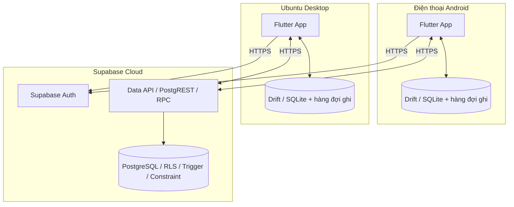

# Personal Finance — Ứng dụng quản lý tài chính cá nhân

Ứng dụng Flutter dành cho **điện thoại Android** và **máy tính Linux**, ưu tiên nhập khoản chi nhanh, sử dụng ngoại tuyến và theo dõi công nợ. Hai ứng dụng dùng chung dữ liệu trên Supabase và đăng nhập bằng cùng một tài khoản.

Tài liệu này hướng dẫn cài môi trường phát triển trên **Ubuntu**, chạy app trên điện thoại Android hoặc máy ảo, và chạy ứng dụng desktop Ubuntu. Giao diện hỗ trợ **English** và **Tiếng Việt**.

> Chạy các lệnh trong tài liệu tại **thư mục gốc của repository**, nơi chứa `README.md`, `android/`, `linux/` và `.env`, trừ khi có ghi chú khác. Không cần khởi động backend hay cài PostgreSQL trên máy để chạy app.

## Mục lục

- [1. Chuẩn bị Flutter trên Ubuntu](#1-chuẩn-bị-flutter-trên-ubuntu)
- [2. Cấu hình Supabase](#2-cấu-hình-supabase)
- [3. Khởi tạo hoặc cập nhật database](#3-khởi-tạo-hoặc-cập-nhật-database)
- [4. Chạy app trên Android](#4-chạy-app-trên-android)
- [5. Chạy desktop app trên Ubuntu](#5-chạy-desktop-app-trên-ubuntu)
- [6. Kiểm tra đồng bộ giữa hai thiết bị](#6-kiểm-tra-đồng-bộ-giữa-hai-thiết-bị)
- [7. Chạy kiểm thử](#7-chạy-kiểm-thử)
- [8. Xử lý lỗi thường gặp](#8-xử-lý-lỗi-thường-gặp)
- [9. Kiến trúc và cấu trúc mã nguồn](#9-kiến-trúc-và-cấu-trúc-mã-nguồn)
- [10. Database và bảo mật](#10-database-và-bảo-mật)
- [11. Đồng bộ ngoại tuyến](#11-đồng-bộ-ngoại-tuyến)
- [12. Trạng thái kiểm chứng và giới hạn](#12-trạng-thái-kiểm-chứng-và-giới-hạn)

## 1. Chuẩn bị Flutter trên Ubuntu

Môi trường build đã được kiểm chứng với **Flutter 3.47.4 / Dart 3.13.3** và môi trường build Linux dựa trên **Ubuntu 24.04 x64**. Hướng dẫn dưới đây dùng Ubuntu Desktop có giao diện đồ họa.

### 1.1. Cài các công cụ cơ bản

```bash
sudo apt-get update
sudo apt-get install -y git curl unzip xz-utils zip python3 python3-venv
```

### 1.2. Cài Flutter SDK

Nếu đã cài Flutter, kiểm tra bằng `flutter --version` và bỏ qua bước tải SDK. Nếu chưa có, có thể cài phiên bản đã dùng để kiểm chứng dự án:

```bash
mkdir -p "$HOME/development"
git clone --branch 3.47.4 --depth 1 https://github.com/flutter/flutter.git "$HOME/development/flutter"
export PATH="$HOME/development/flutter/bin:$PATH"
flutter --version
```

Lệnh `git clone` yêu cầu thư mục đích chưa tồn tại. Không ghi đè một bản Flutter đang dùng cho dự án khác.

Để terminal mới cũng nhận lệnh `flutter`, thêm dòng sau vào cuối `~/.bashrc` nếu dùng Bash mặc định của Ubuntu, hoặc `~/.zshrc` nếu dùng Zsh:

```bash
export PATH="$HOME/development/flutter/bin:$PATH"
```

Mở terminal mới, sau đó kiểm tra:

```bash
flutter doctor -v
```

Chỉ cần xử lý các mục liên quan đến nền tảng muốn chạy: **Android toolchain** cho Android, **Linux toolchain** cho Ubuntu desktop. Không cần cài Chrome để chạy hai ứng dụng này.

Có thể tham khảo cách cài SDK khác tại [hướng dẫn cài Flutter chính thức](https://docs.flutter.dev/install/manual). Không chạy `flutter` bằng `sudo`.

## 2. Cấu hình Supabase

Cả Android và Linux phải dùng **cùng Supabase project** để đồng bộ với nhau.

### 2.1. Lấy URL và khóa công khai

Trong Supabase Dashboard:

1. Mở project của bạn, chọn **Connect** để lấy **Project URL**.
2. Vào **Settings → API Keys**, lấy **publishable key** hoặc khóa **anon** cũ. Trong dự án này, cả hai loại khóa công khai đều được điền vào biến `SUPABASE_ANON_KEY`.
3. Vào **Authentication → Sign In / Providers**, bật đăng nhập bằng **Email**. Nếu bật xác nhận email, người dùng phải xác nhận email sau khi đăng ký.

Tham khảo [tài liệu API key của Supabase](https://supabase.com/docs/guides/getting-started/api-keys) và [khởi tạo Supabase cho Flutter](https://supabase.com/docs/reference/dart/initializing).

### 2.2. Điền `.env` ở thư mục gốc

Nếu chưa có `.env`, tạo từ mẫu bằng lệnh sau. Lệnh này giữ nguyên file nếu nó đã tồn tại:

```bash
test -f .env || cp .env.example .env
```

Mở `.env` bằng trình soạn thảo, điền hai giá trị thực lấy từ Dashboard vào các dòng sau:

```dotenv
SUPABASE_URL=
SUPABASE_ANON_KEY=
```

Các dòng để trống ở trên chỉ mô tả tên biến, không phải cấu hình có thể chạy ngay. Nếu `.env` đã có thông tin PostgreSQL, giữ lại các giá trị đó và bổ sung hai biến client còn thiếu.

| Biến | Mục đích | Đưa vào ứng dụng? |
|---|---|---|
| `SUPABASE_URL` | URL HTTPS của Supabase project | Có |
| `SUPABASE_ANON_KEY` | Publishable key hoặc legacy anon key | Có |
| `SUPABASE_DATABASE_URL` | Chuỗi kết nối PostgreSQL cho migration | **Không** |
| `SUPABASE_DB_HOST`, `SUPABASE_DB_PORT` | Máy chủ và cổng PostgreSQL cho migration | Không |
| `SUPABASE_DB_NAME`, `SUPABASE_DB_USER` | Database và tài khoản quản trị | Không |
| `SUPABASE_DB_PASSWORD` | Mật khẩu PostgreSQL | **Không bao giờ** |

Không dùng mật khẩu database, `service_role` hoặc secret key thay cho `SUPABASE_ANON_KEY`. Không commit `.env`. Quy tắc Git của dự án bao gồm:

```gitignore
.env
.env.*
!.env.example
```

### 2.3. Cách app nhận cấu hình

Các lệnh chạy trong tài liệu sử dụng [flutter_client.py](linux/tool/flutter_client.py). Script này:

- Đọc hai biến công khai từ môi trường terminal hoặc `.env` ở gốc; biến môi trường có giá trị sẽ được ưu tiên.
- Chỉ truyền `SUPABASE_URL` và `SUPABASE_ANON_KEY` vào Flutter bằng `--dart-define`.
- Tự chọn đúng thư mục `android/` hoặc `linux/`.
- Dừng với thông báo rõ ràng nếu thiếu cấu hình hoặc không tìm thấy Flutter.

**Không dùng `--dart-define-from-file=.env`**, vì file này có thể chứa mật khẩu quản trị. `.env` không được đóng gói thành asset của app.

Cấu hình được đưa vào lúc chạy/build. Sau khi thay đổi `.env`, hãy dừng app rồi chạy lại bằng script; với APK hoặc Linux release, cần build lại. Script launcher chỉ cần Python 3, không cần cài thư viện Python bổ sung.

## 3. Khởi tạo hoặc cập nhật database

SQL trong [linux/supabase/migrations/](linux/supabase/migrations/) dùng chung cho **cả Android và Linux**. Đây là công cụ quản trị dành cho người phát triển; người dùng đã cài app không cần các công cụ này.

Nếu project Supabase đã được khởi tạo bằng các migration hiện có, không cần tạo lại database. Công cụ sẽ bỏ qua migration đã được ghi nhận.

### 3.1. Chuẩn bị công cụ quản trị

Tạo môi trường Python riêng ngoài repository:

```bash
python3 -m venv "$HOME/.venvs/personal-finance-admin"
"$HOME/.venvs/personal-finance-admin/bin/pip" install 'psycopg[binary]' python-dotenv
```

Điền thông tin kết nối PostgreSQL trong `.env`, bằng một trong hai cách:

- `SUPABASE_DATABASE_URL`: chuỗi kết nối lấy từ mục **Connect** của Supabase.
- Hoặc bộ biến `SUPABASE_DB_HOST`, `SUPABASE_DB_PORT`, `SUPABASE_DB_NAME`, `SUPABASE_DB_USER`, `SUPABASE_DB_PASSWORD`.

Nếu `SUPABASE_DATABASE_URL` có giá trị, công cụ ưu tiên dùng nó. Không đưa các thông tin này vào mã Flutter.

### 3.2. Kiểm tra trước, rồi chạy migration

```bash
"$HOME/.venvs/personal-finance-admin/bin/python" linux/tool/database.py inspect
"$HOME/.venvs/personal-finance-admin/bin/python" linux/tool/database.py migrate
```

`inspect` chỉ liệt kê tên các bảng công khai, không in mật khẩu. Hãy kiểm tra kết quả trước khi chạy `migrate`, đặc biệt khi dùng một Supabase project đã có dữ liệu.

Công cụ sử dụng SSL, transaction, khóa migration và bảng `finance_schema_migrations` để theo dõi phiên bản. Nó không xóa các bảng không thuộc dự án. Nếu có bảng trùng tên nhưng chưa được quản lý bởi migration này, cần kiểm tra tương thích schema thay vì xóa bảng để chạy tiếp.

Nếu mạng chỉ hỗ trợ IPv4 và không kết nối được host trực tiếp, dùng thông tin kết nối **Session pooler** phù hợp do Supabase cung cấp. Có thể chạy SQL thủ công trong SQL Editor, nhưng không trộn cách đó với công cụ migration khi chưa đồng bộ lịch sử phiên bản.

## 4. Chạy app trên Android

Bạn có thể dùng máy Ubuntu để build và cài app lên điện thoại Android qua USB, hoặc chạy trên Android Emulator.

### 4.1. Cài Android Studio và SDK

Cài [Android Studio](https://developer.android.com/studio), mở chương trình và hoàn thành trình thiết lập ban đầu. Trong **SDK Manager**, cài Android SDK Platform API 36 cùng các công cụ Build-Tools, Command-line Tools, Platform-Tools, NDK và CMake. Cài thêm Android Emulator nếu dùng máy ảo. Đây là quy trình theo [hướng dẫn Flutter cho Android](https://docs.flutter.dev/platform-integration/android/setup).

Với phiên bản dự án đã kiểm chứng, môi trường build sử dụng thêm SDK Platform 35 cho dependency, NDK `28.2.13676358`, CMake `3.22.1` và JDK 21. Gradle có thể tải thành phần còn thiếu trong lần build đầu nếu SDK đã được cấu hình và giấy phép đã được chấp nhận.

Sau đó chạy:

```bash
flutter doctor --android-licenses
flutter doctor -v
```

Đọc và chấp nhận các giấy phép cần thiết. Đảm bảo mục **Android toolchain** không còn lỗi chặn build. Flutter thường nhận JDK đi kèm Android Studio; đường dẫn JDK thực tế hiển thị trong `flutter doctor -v`.

### 4.2. Kết nối điện thoại thật

Trên điện thoại:

1. Bật **Developer options / Tùy chọn nhà phát triển** trong phần cài đặt thiết bị.
2. Bật **USB debugging / Gỡ lỗi USB**.
3. Kết nối với Ubuntu bằng cáp có truyền dữ liệu.
4. Mở khóa điện thoại và chấp nhận hộp thoại cho phép máy tính gỡ lỗi USB.

Kiểm tra thiết bị trên Ubuntu:

```bash
flutter devices
```

Bạn cần thấy thiết bị Android trong danh sách. Nếu có `adb` trên `PATH`, có thể kiểm tra thêm bằng `adb devices`; trạng thái phải là `device`, không phải `unauthorized`.

### 4.3. Hoặc khởi động máy ảo

Trong Android Studio, mở **Device Manager**, tạo một thiết bị ảo, tải system image phù hợp rồi nhấn nút chạy. Khi máy ảo khởi động xong, chạy lại `flutter devices` để lấy ID.

### 4.4. Cài dependency và chạy app

Tại gốc repository:

```bash
(cd android && flutter pub get)
python3 linux/tool/flutter_client.py android run
```

Nếu có nhiều thiết bị, chỉ định ID lấy từ `flutter devices`. Thay `ANDROID_DEVICE_ID` trong lệnh dưới bằng ID thực tế:

```bash
python3 linux/tool/flutter_client.py android run -d ANDROID_DEVICE_ID
```

Lần chạy đầu cần mạng để tải dependency, Gradle và SDK còn thiếu. Flutter sẽ build, cài app và mở app trên thiết bị. Trong terminal đang chạy Flutter, nhấn `r` để hot reload hoặc `q` để kết thúc phiên chạy.

Đăng ký tài khoản bằng email, xác nhận email nếu được yêu cầu, rồi đăng nhập. Sau lần đăng nhập đầu tiên trên thiết bị, app yêu cầu chọn **English** hoặc **Tiếng Việt** rồi nhấn **Continue / Tiếp tục**. Lựa chọn được lưu riêng cho từng tài khoản trên thiết bị, giữ lại khi mở lại app hoặc đăng xuất và dùng được ngoại tuyến. Khi đăng nhập trên thiết bị khác hoặc cài lại app, bạn chọn lại ngôn ngữ trên thiết bị đó.

Để đổi ngôn ngữ: trên Android vào **More → Settings → Language** (hoặc **Thêm → Cài đặt → Ngôn ngữ**); trên Ubuntu chọn **Settings / Cài đặt** ở thanh bên. Giao diện đổi ngay, không cần khởi động lại. Tên tài khoản, danh mục, nhãn, giao dịch và nội dung ghi chú đã lưu không bị dịch hoặc sửa tự động.

Các danh mục mặc định được khởi tạo ở lần đồng bộ thành công đầu tiên.

### 4.5. Build APK để cài thử

```bash
python3 linux/tool/flutter_client.py android build apk --debug
```

APK được tạo tại:

```text
android/build/app/outputs/flutter-apk/app-debug.apk
```

Có thể chép APK sang điện thoại để cài và cho phép cài ứng dụng từ nguồn đang sử dụng khi Android yêu cầu. Nếu đã có `adb` và chỉ kết nối một thiết bị, cài bằng:

```bash
adb install -r android/build/app/outputs/flutter-apk/app-debug.apk
```

Đây là bản debug để thử nghiệm. Bản release yêu cầu keystore riêng và đủ bốn biến môi trường trong terminal build:

```text
ANDROID_KEYSTORE_PATH
ANDROID_KEYSTORE_PASSWORD
ANDROID_KEY_ALIAS
ANDROID_KEY_PASSWORD
```

`ANDROID_KEYSTORE_PATH` nên là đường dẫn tuyệt đối. Không commit keystore hoặc mật khẩu. Script không tự đọc các biến ký APK từ `.env`; hãy cung cấp chúng trong môi trường build. Khi đã cấu hình chữ ký:

```bash
python3 linux/tool/flutter_client.py android build apk --release
```

APK release nằm tại `android/build/app/outputs/flutter-apk/app-release.apk`. Gradle sẽ từ chối build release nếu thiếu cấu hình ký, không tự dùng chữ ký debug.

## 5. Chạy desktop app trên Ubuntu

Nếu chỉ chạy bản desktop, bạn có thể bỏ qua toàn bộ bước cài Android Studio/SDK ở mục 4.

### 5.1. Cài thư viện build Linux

```bash
sudo apt-get update
sudo apt-get install -y clang cmake ninja-build pkg-config libgtk-3-dev libstdc++-12-dev libsecret-1-dev libjsoncpp-dev
flutter config --enable-linux-desktop
flutter doctor -v
flutter devices
```

Các công cụ biên dịch và GTK dựa trên [hướng dẫn Flutter cho Linux](https://docs.flutter.dev/platform-integration/linux/setup). Dự án cần thêm thư viện Secret Service và JSON để hỗ trợ các plugin hiện có.

Trong `flutter doctor -v`, kiểm tra mục **Linux toolchain**. Trong `flutter devices`, cần có thiết bị `linux`.

App lưu phiên đăng nhập bằng secure storage của hệ điều hành. Trên Ubuntu Desktop, hãy dùng phiên đăng nhập đồ họa có **GNOME Keyring / Secret Service đang mở khóa**. Không chạy app bằng `sudo`.

### 5.2. Chạy ở chế độ phát triển

Sau khi đã điền hai biến client trong `.env` và chuẩn bị schema Supabase:

```bash
(cd linux && flutter pub get)
python3 linux/tool/flutter_client.py linux run -d linux
```

Cửa sổ ứng dụng sẽ mở trên desktop. Đăng nhập bằng **cùng tài khoản đã dùng trên Android** để xem dữ liệu chung.

Ở cửa sổ rộng, app hiển thị thanh điều hướng bên trái và bảng giao dịch. Các phím tắt:

| Phím | Thao tác |
|---|---|
| `Ctrl + N` | Tạo giao dịch |
| `Ctrl + K` | Mở tìm kiếm toàn cục |
| `Ctrl + F` | Mở tìm kiếm dữ liệu cục bộ toàn cục |
| `Escape` | Đóng hộp thoại |

### 5.3. Build và chạy bản release

```bash
python3 linux/tool/flutter_client.py linux build linux --release
./linux/build/linux/x64/release/bundle/finance_linux
```

Đường dẫn trên áp dụng cho máy **x64**. Flutter sẽ in đường dẫn đầu ra thực tế khi build.

Khi chép sang thư mục khác hoặc máy Ubuntu tương thích, phải chép **toàn bộ thư mục bundle**, không chỉ file thực thi:

```text
linux/build/linux/x64/release/bundle/
├── finance_linux
├── data/
└── lib/
```

Máy nhận không cần Flutter SDK để chạy bundle, nhưng cần thư viện hệ thống tương thích, môi trường đồ họa và Secret Service. Bundle chưa phải bộ cài `.deb`, AppImage hoặc Snap. Nếu máy nhận dùng Ubuntu khác phiên bản build, cần kiểm tra tương thích thư viện hoặc build lại trên môi trường đích.

Hai Dockerfile trong `linux/tool/` là môi trường **build cục bộ tùy chọn** dành cho phát triển. Không cần Docker để chạy app theo hướng dẫn này và không có container backend phải duy trì.

## 6. Kiểm tra đồng bộ giữa hai thiết bị

Sau khi đăng nhập lần đầu và đồng bộ thành công:

1. Trên Android, tạo tài khoản tiền **MB Bank**, đơn vị **VND**.
2. Tạo khoản chi: số tiền `45k`, mô tả `Coffee`, danh mục `Food`, tag `coffee`, tài khoản `MB Bank`.
3. Giao dịch phải xuất hiện ngay trong danh sách. Mở **Settings**, kiểm tra trạng thái đồng bộ; dùng đồng bộ thủ công nếu cần.
4. Trên Ubuntu, đăng nhập cùng tài khoản và đồng bộ. Kiểm tra giao dịch Coffee xuất hiện.
5. Tắt mạng Android, tạo khoản chi `72k`, mô tả `Grab`. Giao dịch phải xuất hiện cục bộ dù chưa có mạng.
6. Bật mạng lại, giữ app mở và đồng bộ. Kiểm tra giao dịch Grab xuất hiện trên Ubuntu.
7. Thử tạo người `Nam`, khoản cho vay `1m`, sau đó ghi nhận trả `300k`. Số còn lại phải là `700,000 ₫`.
8. Thử chuyển tiền giữa hai tài khoản cùng đơn vị tiền tệ. Số dư phải thay đổi nhưng tổng thu/chi thông thường trong tháng không tăng vì khoản chuyển này.

Lần đăng nhập đầu tiên cần Internet. Để kiểm tra ngoại tuyến, hãy đăng nhập trước rồi mới ngắt mạng. **Đăng xuất sẽ xóa cache riêng tư và hàng đợi đồng bộ trên thiết bị**, vì vậy cần đồng bộ các thay đổi đang chờ trước khi đăng xuất.

Hướng dẫn nghiệm thu chi tiết: [linux/docs/acceptance.md](linux/docs/acceptance.md).

## 7. Chạy kiểm thử

### Dart / Flutter

Tại gốc repository:

```bash
(cd linux/packages/finance_core && flutter pub get && flutter analyze && flutter test)
(cd android && flutter pub get && flutter analyze && flutter test)
(cd linux && flutter pub get && flutter analyze && flutter test)
```

Các test tự động này không yêu cầu khóa Supabase thật. Bộ test dùng chung kiểm tra tính tiền chính xác, số dư, chuyển khoản, tổng tháng loại trừ dòng tiền công nợ, trả nợ từng phần, SQLite, hàng đợi đồng bộ, lỗi/retry, cập nhật từ xa, xóa mềm, xung đột, đăng xuất và các form/màn hình quan trọng.

### SQL / RLS trên Supabase

Sau khi chuẩn bị công cụ quản trị ở mục 3:

```bash
"$HOME/.venvs/personal-finance-admin/bin/python" linux/tool/database.py test
```

Test tạo tài khoản và dữ liệu giả trong transaction, giả lập hai người dùng khác nhau, kiểm tra phân quyền và rollback sau khi chạy. Nội dung bao gồm chặn truy cập chéo người dùng, giả mạo chủ sở hữu, liên kết ID của người khác, ghi trực tiếp trái phép, tính nguyên tử của thao tác công nợ, trả quá số nợ và retry không trùng dữ liệu.

## 8. Xử lý lỗi thường gặp

| Hiện tượng | Cách xử lý |
|---|---|
| `flutter: command not found` | Thêm thư mục `flutter/bin` vào `PATH`, mở terminal mới và chạy `flutter --version`. |
| `Missing SUPABASE_URL or SUPABASE_ANON_KEY` | Điền đủ hai giá trị công khai trong `.env` ở gốc. Thông tin PostgreSQL không thay thế được chúng. |
| App hiện lỗi cấu hình dù vừa sửa `.env` | Dừng rồi chạy lại bằng `flutter_client.py`; APK/bundle cũ cần build lại. Kiểm tra biến môi trường terminal có đang ghi đè `.env` không. |
| Thiếu Android licenses hoặc Command-line Tools | Cài công cụ trong SDK Manager rồi chạy `flutter doctor --android-licenses`. |
| Flutter không nhận Android SDK | Kiểm tra đường dẫn trong SDK Manager; cấu hình bằng `flutter config --android-sdk /duong/dan/SDK` với đường dẫn thực, rồi chạy lại `flutter doctor -v`. |
| Không thấy điện thoại hoặc trạng thái `unauthorized` | Bật USB debugging, mở khóa điện thoại, chấp nhận quyền kết nối và thử cáp truyền dữ liệu khác. |
| Không có thiết bị `linux` | Chạy `flutter config --enable-linux-desktop`, kiểm tra Linux toolchain và sử dụng phiên Ubuntu có giao diện đồ họa. |
| Thiếu CMake, Ninja, GTK hoặc libsecret | Cài đầy đủ gói ở mục 5.1 rồi kiểm tra lại `flutter doctor -v`. |
| Lỗi lưu/khôi phục phiên đăng nhập Linux | Kiểm tra GNOME Keyring/Secret Service đang chạy và được mở khóa; chạy app bằng tài khoản desktop hiện tại. |
| Đăng ký xong nhưng chưa đăng nhập được | Kiểm tra email xác nhận và cấu hình Email provider trong Supabase. |
| Thay đổi lưu cục bộ nhưng không đồng bộ | Kiểm tra mạng, trạng thái đăng nhập, URL/key cùng project và migration đã áp dụng; thử đồng bộ thủ công trong Settings. |
| Hai thiết bị không thấy dữ liệu của nhau | Kiểm tra chúng dùng cùng Supabase project, cùng tài khoản đăng nhập và đã đồng bộ. |
| Linux báo thiếu thư viện khi chạy bundle | Giữ nguyên `data/`, `lib/` cạnh file thực thi; kiểm tra thư viện hệ thống và phiên bản Ubuntu đích. |

## 9. Kiến trúc và cấu trúc mã nguồn

Cả hai app dùng **Flutter, Dart, Material 3, Riverpod, go_router, supabase_flutter, Drift và SQLite**. Không có FastAPI, Node.js, Express hay application server riêng.



PostgreSQL là nguồn dữ liệu chuẩn trên cloud. SQLite phục vụ giao diện nhanh, cache và ghi ngoại tuyến. App chỉ kết nối Supabase qua SDK/HTTPS; kết nối PostgreSQL trực tiếp qua SSL chỉ có trong công cụ migration của người phát triển.

```text
.
├── .env                         # Cấu hình cục bộ, không commit
├── .env.example                 # Mẫu biến môi trường
├── README.md
├── android/                     # Flutter project dành cho Android
│   ├── lib/main.dart
│   ├── android/                 # Native runner, Gradle và ký APK
│   └── test/
└── linux/                       # Flutter project dành cho Linux
    ├── lib/main.dart
    ├── linux/                   # Native GTK runner
    ├── packages/finance_core/   # Mã dùng chung cho CẢ HAI app
    │   ├── lib/app/
    │   ├── lib/core/
    │   ├── lib/features/
    │   └── test/
    ├── supabase/
    │   ├── migrations/          # Một schema dùng chung
    │   └── tests/               # Kiểm thử SQL và RLS
    ├── tool/                   # Launcher, quản trị DB, Dockerfile build
    └── docs/                   # Checklist và kịch bản nghiệm thu
```

UI đi qua provider/controller, repository rồi đến nguồn dữ liệu local/remote. Package `finance_core` chia sẻ logic tài chính và đồng bộ, tránh sao chép giữa hai nền tảng. Giao diện tự thích ứng: điều hướng dưới trên màn hình nhỏ, sidebar và bảng dữ liệu trên desktop rộng.

### Chức năng hiện có

- Đăng ký, đăng nhập email/mật khẩu, khôi phục phiên và đăng xuất.
- Tài khoản tiền, số dư đầu kỳ, số dư từ sổ giao dịch, chỉnh sửa và lưu trữ tài khoản.
- Thu, chi, chuyển khoản; nhập nhanh `45k`, `1.5m`; danh mục, nhiều tag, ngày giờ và ghi chú.
- Danh sách giao dịch, chi tiết, sửa, xóa mềm, lọc tháng/loại/tài khoản/danh mục/tag.
- Tổng quan tháng: thu, chi, chênh lệch, tỷ lệ tiết kiệm, danh mục, tag và công nợ.
- Người liên quan, cho vay/đi vay, trả từng phần và liên kết dòng tiền.
- Ghi chú văn bản, ghim, tìm kiếm, liên kết người và ngày nhắc tùy chọn.
- Tìm kiếm cục bộ, giao diện sáng/tối/theo hệ thống, trạng thái và đồng bộ thủ công.

## 10. Database và bảo mật

| Bảng | Dữ liệu |
|---|---|
| `accounts` | Tài khoản và số dư đầu kỳ |
| `categories` | Danh mục thu/chi |
| `tags` | Nhãn ngữ cảnh riêng của người dùng |
| `people` | Người liên quan và thông tin tùy chọn |
| `transactions` | Giao dịch thu/chi/chuyển khoản và mục đích dòng tiền |
| `transaction_tags` | Liên kết giao dịch với tag |
| `debts` | Khoản cho vay hoặc đi vay |
| `debt_payments` | Các lần trả nợ |
| `notes` | Ghi chú và liên kết tùy chọn |
| `finance_operations` | Biên nhận nội bộ để retry RPC không trùng |
| `finance_schema_migrations` | Lịch sử migration nội bộ |

Các bảng nghiệp vụ có `user_id` tham chiếu `auth.users`, UUID được tạo ở client, timestamp tương thích UTC và `deleted_at` phục vụ xóa mềm. Quan hệ chính: tài khoản/danh mục → giao dịch; giao dịch → `transaction_tags` → tag; người → khoản nợ → lần trả nợ. Khóa ngoại ghép `(user_id, id)` ngăn liên kết sang dữ liệu của người khác.

RLS được bật và bắt buộc trên mọi bảng nghiệp vụ. Chính sách đọc kiểm tra `auth.uid() = user_id`. Quyền ghi trực tiếp qua Data API bị thu hồi; ứng dụng ghi qua RPC `finance_apply`, với danh sách bảng cho phép, kiểm tra chủ sở hữu và transaction cho thao tác nhiều dòng. Không cho client hard delete. View `finance_debt_balances` dùng `security_invoker`; các bảng biên nhận nội bộ không cho client đọc.

Khóa công khai có thể bị trích xuất từ APK hoặc binary. Bảo mật dựa vào **Supabase Auth + RLS + kiểm tra quyền trong PostgreSQL**, không dựa vào việc giấu khóa trong Flutter. Xem thêm [tài liệu RLS của Supabase](https://supabase.com/docs/guides/database/postgres/row-level-security).

### Quy tắc tiền và công nợ

- Tiền dùng đơn vị nhỏ nhất dưới dạng số nguyên: Dart `int`, SQLite INTEGER, PostgreSQL `numeric(20,0)`. Ví dụ `45,000 VND = 45000`, `1.23 USD = 123`; không tính tiền bằng số thực.
- VND/JPY dùng 0 chữ số thập phân; USD/EUR/GBP dùng 2. Giá trị đơn lẻ tối đa là `9,000,000,000,000,000` đơn vị nhỏ nhất.
- Số dư = số dư đầu kỳ + thu − chi + chuyển vào − chuyển ra. Chuyển khoản yêu cầu cùng loại tiền và không tính vào thu/chi tháng.
- Dòng tiền công nợ dùng `purpose=debt_disbursement` hoặc `debt_repayment`; thống kê thu/chi thông thường chỉ tính `purpose=normal`.
- Nợ còn lại = tiền gốc − các lần trả chưa bị xóa. Khoản nợ/lần trả và giao dịch liên kết được ghi nguyên tử cả cục bộ và trên cloud.
- Ngày giờ hiển thị theo múi giờ thiết bị. Ranh giới tháng được xác định theo lịch địa phương rồi đổi sang UTC để lọc dữ liệu.

## 11. Đồng bộ ngoại tuyến

1. Repository kiểm tra dữ liệu, tạo UUID và ghi bản ghi cùng thao tác chờ vào SQLite trong một transaction.
2. Giao diện quan sát SQLite và cập nhật ngay, không chờ mạng.
3. Sync worker chạy khi mở app, quay lại app, sau khi ghi, định kỳ 30 giây khi app đang mở hoặc khi người dùng đồng bộ thủ công.
4. Thao tác chờ được gửi qua `finance_apply`. PostgreSQL chấp nhận toàn bộ thao tác hoặc rollback. Biên nhận theo người dùng và ID thao tác giúp retry an toàn khi mất phản hồi.
5. Client tải dữ liệu từ xa theo trang 250 dòng, gồm bản ghi xóa mềm, rồi hợp nhất mà không ghi đè thay đổi cục bộ đang chờ.
6. Khi thành công, lưu `last_successful_sync`; khi lỗi, giữ hàng đợi và hiển thị trạng thái để thử lại.

Xung đột dùng thứ tự `(client_modified_at, mutation_id)`: cặp lớn hơn thắng. `updated_at` do PostgreSQL cập nhật riêng. Đây là chiến lược chọn phiên bản mới hơn, không hợp nhất từng trường; đồng hồ thiết bị sai có thể ảnh hưởng kết quả. Timestamp vượt quá thời gian server trên 5 phút bị từ chối. Nếu một dòng trong thao tác nguyên tử thua xung đột thì toàn bộ thao tác đó thua, và app thông báo xung đột.

MVP dùng đối soát toàn bộ dữ liệu có phân trang, chưa dùng tải tăng dần hoặc Realtime. Cách này phục hồi sau thời gian ngoại tuyến dài, nhưng tốn băng thông hơn khi lịch sử lớn. Giao diện giao dịch hiển thị từng trang 50 dòng trong tháng được chọn; tìm kiếm cục bộ giới hạn 80 kết quả.

Đăng xuất dừng đồng bộ rồi xóa dữ liệu riêng tư, hàng đợi và metadata cục bộ. Phiên đăng nhập dùng secure storage; dữ liệu tài chính SQLite chưa được mã hóa toàn bộ khi lưu trên đĩa. App không tự đồng bộ khi đã đóng hoàn toàn.

## 12. Trạng thái kiểm chứng và giới hạn

Trong đợt triển khai trước khi viết hướng dẫn này, đã chạy thành công:

- `flutter analyze` và 38 test trong package dùng chung.
- `flutter analyze` cùng 1 test launcher ở mỗi project Android và Linux.
- Hai bộ kiểm thử SQL/RLS có rollback trên Supabase.
- Build APK debug Android ARM64 và kiểm tra chữ ký APK.
- Build Linux release và kiểm tra khởi động native.

Các binary kiểm chứng được build **chưa có cấu hình client**, nên hiển thị màn hình cấu hình. Cần điền `SUPABASE_URL`, `SUPABASE_ANON_KEY` rồi chạy/build lại theo hướng dẫn. Chưa kiểm chứng luồng đăng nhập thật và đồng bộ xuyên hai thiết bị bằng tài khoản thực; các bước ở mục 6 là kịch bản cần thực hiện, không phải tuyên bố đã nghiệm thu.

Giới hạn hiện tại:

- Chưa có ngân sách, giao dịch định kỳ, nhập/xuất, ảnh hóa đơn, chuyển đổi ngoại tệ hoặc tăng tốc đồng bộ bằng Realtime.
- Ngày nhắc trong ghi chú chỉ được lưu/hiển thị, chưa phát thông báo. Chưa có luồng quên mật khẩu/khôi phục qua deep link.
- Chưa có UI sửa tiền gốc/hướng khoản nợ hoặc hủy nợ. Có thêm/xóa lần trả; trạng thái tất toán được suy ra từ số còn lại.
- Chi tiết người hiển thị nợ và ghi chú; giao dịch liên quan có thể tìm qua tìm kiếm toàn cục, chưa có bảng lịch sử riêng đầy đủ.
- Thao tác bị server từ chối cần được sửa và thử lại; trùng tên do tạo độc lập trên hai thiết bị ngoại tuyến có thể cần xử lý thủ công.
- Chưa kiểm chứng đầy đủ từng môi trường X11/Wayland hoặc mọi phiên bản Ubuntu. Dữ liệu quy mô rất lớn sẽ cần tối ưu chiến lược tải và tổng hợp.

Xem [checklist triển khai](linux/docs/implementation.md) và [kịch bản nghiệm thu](linux/docs/acceptance.md) để biết thêm chi tiết kỹ thuật.
