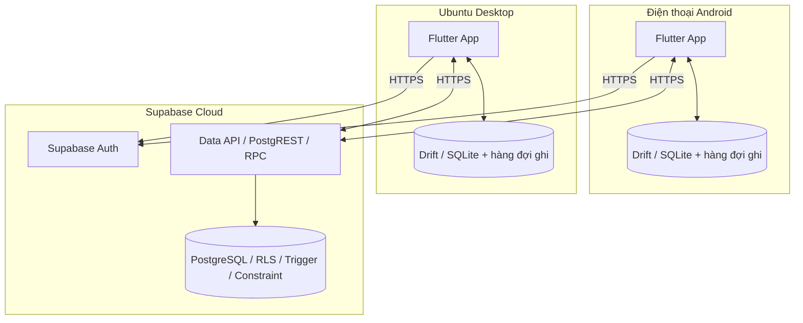
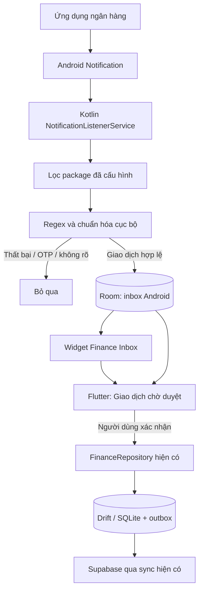

# Finance Inbox — Ứng dụng quản lý tài chính cá nhân

Ứng dụng Flutter dành cho **điện thoại Android** và **máy tính Linux**, ưu tiên nhập khoản chi nhanh, sử dụng ngoại tuyến và theo dõi công nợ. Hai ứng dụng dùng chung dữ liệu trên Supabase và đăng nhập bằng cùng một tài khoản.

Tài liệu này hướng dẫn cài môi trường phát triển trên **Ubuntu**, chạy app trên điện thoại Android hoặc máy ảo, và chạy ứng dụng desktop Ubuntu. Giao diện hỗ trợ **English** và **Tiếng Việt**.

> Chạy các lệnh trong tài liệu tại **thư mục gốc của repository**, nơi chứa `README.md`, `android/`, `linux/` và `.env`, trừ khi có ghi chú khác. Không cần khởi động backend hay cài PostgreSQL trên máy để chạy app.

## Bắt đầu nhanh cho người nhận repository

Bạn cần **máy tính** để tải mã nguồn và build; chỉ tải repository về điện thoại sẽ không chạy được app.
Hướng dẫn này dùng Ubuntu 24.04/Zorin 18 x86_64. Android cần điện thoại bật USB debugging
hoặc emulator; các bước cài Flutter, JDK và Android SDK nằm ở mục 1 và mục 4 bên dưới.

### Lần đầu lấy mã nguồn

```bash
git clone https://github.com/marvinphung/personal-management.git
cd personal-management
test -f .env || cp .env.example .env
```

Repository riêng tư yêu cầu chủ repo cấp quyền GitHub trước khi clone.
Mở `.env` và điền **chỉ hai biến client** `SUPABASE_URL`, `SUPABASE_ANON_KEY`:

- Dùng chung Supabase với chủ repo: xin hai giá trị công khai này từ chủ repo.
  Đăng ký tài khoản app riêng; RLS tách dữ liệu giữa các người dùng. Không dùng chung mật khẩu đăng nhập.
  Người dùng thông thường **không cần chạy migration**, không cần mật khẩu PostgreSQL.
- Dùng Supabase riêng: tạo project, lấy hai giá trị ở mục 2 và tự chạy các migration ở mục 3.
  Không chạy migration lên database của người khác nếu chưa được giao quản trị.

`.env`, khóa ký, APK và `.deb` không nằm trong Git. Không gửi nguyên `.env` của chủ repo
vì file đó có thể chứa thông tin quản trị database. Chỉ có mã nguồn và `.env.example` là chưa đủ để đăng nhập.

### Chạy Android qua USB

Sau khi cài công cụ theo mục 1 và 4, cắm cáp dữ liệu, mở khóa điện thoại và chấp nhận USB debugging:

```bash
flutter doctor -v
flutter devices
(cd android && flutter pub get)
python3 linux/tool/flutter_client.py android run -d ANDROID_DEVICE_ID
```

Thay `ANDROID_DEVICE_ID` bằng ID của **điện thoại bạn**, lấy từ `flutter devices`.
Lệnh sẽ build và cài bản debug qua USB. Không cần chép APK vào trình quản lý file.
Không bảo đảm việc cài APK bằng trình quản lý file được Play Protect cho phép vì app đọc thông báo ngân hàng.
Không yêu cầu tắt Play Protect.

Đăng ký/đăng nhập tài khoản riêng, chọn ngôn ngữ. Để tự nhập thông báo ngân hàng:
vào **Cài đặt → Nhập thông báo ngân hàng**, bật thu thập, cấp **Notification Access**
trong Android và chọn tài khoản mặc định cho ngân hàng. Chỉ nhận thông báo mới sau khi bật quyền;
không khôi phục lịch sử thông báo cũ. Nếu Android chặn cấp quyền, đọc thông báo hệ thống
và hướng dẫn quyền truy cập của thiết bị; ứng dụng không tự cấp quyền thay người dùng.

### Chạy trên Ubuntu

Sau khi cài thư viện ở mục 5:

```bash
(cd linux && flutter pub get)
python3 linux/tool/flutter_client.py linux run -d linux
```

Đăng nhập cùng tài khoản app trên Android và Ubuntu nếu muốn đồng bộ dữ liệu của chính bạn.

### Cập nhật khi repo có phiên bản mới

Tại thư mục gốc dự án, khi không có thay đổi mã nguồn cục bộ cần xử lý:

```bash
git pull --ff-only
(cd android && flutter pub get)
(cd linux && flutter pub get)
```

Sau đó chạy lại lệnh cho nền tảng cần dùng. Nếu Git báo xung đột hoặc nhánh đã phân kỳ,
kiểm tra thay đổi của bạn trước; không dùng reset để xóa chúng. `.env` đang có được giữ nguyên.
Chủ Supabase áp dụng migration mới khi cần. Giữ cùng máy/khóa ký cho các lần cập nhật Android;
đổi từ debug sang release hoặc đổi máy build có thể gây xung đột chữ ký. Đồng bộ dữ liệu
và xử lý hết inbox cục bộ trước khi cân nhắc gỡ app.

## Mục lục

- [1. Chuẩn bị Flutter trên Ubuntu](#1-chuẩn-bị-flutter-trên-ubuntu)
- [2. Cấu hình Supabase](#2-cấu-hình-supabase)
- [3. Khởi tạo hoặc cập nhật database](#3-khởi-tạo-hoặc-cập-nhật-database)
- [4. Chạy app trên Android](#4-chạy-app-trên-android)
- [5. Chạy desktop app trên Ubuntu](#5-chạy-desktop-app-trên-ubuntu)
- [6. Kiểm tra đồng bộ giữa hai thiết bị](#6-kiểm-tra-đồng-bộ-giữa-hai-thiết-bị)
- [7. Chạy kiểm thử](#7-chạy-kiểm-thử)
- [8. Xử lý lỗi thường gặp](#8-xử-lý-lỗi-thường-gặp)
- [9. Kiến trúc và cấu trúc mã nguồn](#9-kiến-trúc-và-cấu-trúc-mã-nguồn)
- [10. Database và bảo mật](#10-database-và-bảo-mật)
- [11. Đồng bộ ngoại tuyến](#11-đồng-bộ-ngoại-tuyến)
- [12. Trạng thái kiểm chứng và giới hạn](#12-trạng-thái-kiểm-chứng-và-giới-hạn)

## 1. Chuẩn bị Flutter trên Ubuntu

Môi trường build đã được kiểm chứng với **Flutter 3.47.4 / Dart 3.13.3** và môi trường build Linux dựa trên **Ubuntu 24.04 x64**. Hướng dẫn dưới đây dùng Ubuntu Desktop có giao diện đồ họa.

### 1.1. Cài các công cụ cơ bản

```bash
sudo apt-get update
sudo apt-get install -y git curl unzip xz-utils zip python3 python3-venv
```

### 1.2. Cài Flutter SDK

Nếu đã cài Flutter, kiểm tra bằng `flutter --version` và bỏ qua bước tải SDK. Nếu chưa có, có thể cài phiên bản đã dùng để kiểm chứng dự án:

```bash
mkdir -p "$HOME/development"
git clone --branch 3.47.4 --depth 1 https://github.com/flutter/flutter.git "$HOME/development/flutter"
export PATH="$HOME/development/flutter/bin:$PATH"
flutter --version
```

Lệnh `git clone` yêu cầu thư mục đích chưa tồn tại. Không ghi đè một bản Flutter đang dùng cho dự án khác.

Để terminal mới cũng nhận lệnh `flutter`, thêm dòng sau vào cuối `~/.bashrc` nếu dùng Bash mặc định của Ubuntu, hoặc `~/.zshrc` nếu dùng Zsh:

```bash
export PATH="$HOME/development/flutter/bin:$PATH"
```

Mở terminal mới, sau đó kiểm tra:

```bash
flutter doctor -v
```

Chỉ cần xử lý các mục liên quan đến nền tảng muốn chạy: **Android toolchain** cho Android, **Linux toolchain** cho Ubuntu desktop. Không cần cài Chrome để chạy hai ứng dụng này.

Có thể tham khảo cách cài SDK khác tại [hướng dẫn cài Flutter chính thức](https://docs.flutter.dev/install/manual). Không chạy `flutter` bằng `sudo`.

## 2. Cấu hình Supabase

Cả Android và Linux phải dùng **cùng Supabase project** để đồng bộ với nhau.

### 2.1. Lấy URL và khóa công khai

Trong Supabase Dashboard:

1. Mở project của bạn, chọn **Connect** để lấy **Project URL**.
2. Vào **Settings → API Keys**, lấy **publishable key** hoặc khóa **anon** cũ. Trong dự án này, cả hai loại khóa công khai đều được điền vào biến `SUPABASE_ANON_KEY`.
3. Vào **Authentication → Sign In / Providers**, bật đăng nhập bằng **Email**. Nếu bật xác nhận email, người dùng phải xác nhận email sau khi đăng ký.

Tham khảo [tài liệu API key của Supabase](https://supabase.com/docs/guides/getting-started/api-keys) và [khởi tạo Supabase cho Flutter](https://supabase.com/docs/reference/dart/initializing).

### 2.2. Điền `.env` ở thư mục gốc

Nếu chưa có `.env`, tạo từ mẫu bằng lệnh sau. Lệnh này giữ nguyên file nếu nó đã tồn tại:

```bash
test -f .env || cp .env.example .env
```

Mở `.env` bằng trình soạn thảo, điền hai giá trị thực lấy từ Dashboard vào các dòng sau:

```dotenv
SUPABASE_URL=
SUPABASE_ANON_KEY=
```

Các dòng để trống ở trên chỉ mô tả tên biến, không phải cấu hình có thể chạy ngay. Nếu `.env` đã có thông tin PostgreSQL, giữ lại các giá trị đó và bổ sung hai biến client còn thiếu.

| Biến | Mục đích | Đưa vào ứng dụng? |
|---|---|---|
| `SUPABASE_URL` | URL HTTPS của Supabase project | Có |
| `SUPABASE_ANON_KEY` | Publishable key hoặc legacy anon key | Có |
| `SUPABASE_DATABASE_URL` | Chuỗi kết nối PostgreSQL cho migration | **Không** |
| `SUPABASE_DB_HOST`, `SUPABASE_DB_PORT` | Máy chủ và cổng PostgreSQL cho migration | Không |
| `SUPABASE_DB_NAME`, `SUPABASE_DB_USER` | Database và tài khoản quản trị | Không |
| `SUPABASE_DB_PASSWORD` | Mật khẩu PostgreSQL | **Không bao giờ** |

Không dùng mật khẩu database, `service_role` hoặc secret key thay cho `SUPABASE_ANON_KEY`. Không commit `.env`. Quy tắc Git của dự án bao gồm:

```gitignore
.env
.env.*
!.env.example
```

### 2.3. Cách app nhận cấu hình

Các lệnh chạy trong tài liệu sử dụng [flutter_client.py](linux/tool/flutter_client.py). Script này:

- Đọc hai biến công khai từ môi trường terminal hoặc `.env` ở gốc; biến môi trường có giá trị sẽ được ưu tiên.
- Chỉ truyền `SUPABASE_URL` và `SUPABASE_ANON_KEY` vào Flutter bằng `--dart-define`.
- Tự chọn đúng thư mục `android/` hoặc `linux/`.
- Dừng với thông báo rõ ràng nếu thiếu cấu hình hoặc không tìm thấy Flutter.

**Không dùng `--dart-define-from-file=.env`**, vì file này có thể chứa mật khẩu quản trị. `.env` không được đóng gói thành asset của app.

Cấu hình được đưa vào lúc chạy/build. Sau khi thay đổi `.env`, hãy dừng app rồi chạy lại bằng script; với APK hoặc Linux release, cần build lại. Script launcher chỉ cần Python 3, không cần cài thư viện Python bổ sung.

## 3. Khởi tạo hoặc cập nhật database

SQL trong [linux/supabase/migrations/](linux/supabase/migrations/) dùng chung cho **cả Android và Linux**. Đây là công cụ quản trị dành cho người phát triển; người dùng đã cài app không cần các công cụ này.

Nếu project Supabase đã được khởi tạo bằng các migration hiện có, không cần tạo lại database. Công cụ sẽ bỏ qua migration đã được ghi nhận.

### 3.1. Chuẩn bị công cụ quản trị

Tạo môi trường Python riêng ngoài repository:

```bash
python3 -m venv "$HOME/.venvs/personal-finance-admin"
"$HOME/.venvs/personal-finance-admin/bin/pip" install 'psycopg[binary]' python-dotenv
```

Điền thông tin kết nối PostgreSQL trong `.env`, bằng một trong hai cách:

- `SUPABASE_DATABASE_URL`: chuỗi kết nối lấy từ mục **Connect** của Supabase.
- Hoặc bộ biến `SUPABASE_DB_HOST`, `SUPABASE_DB_PORT`, `SUPABASE_DB_NAME`, `SUPABASE_DB_USER`, `SUPABASE_DB_PASSWORD`.

Nếu `SUPABASE_DATABASE_URL` có giá trị, công cụ ưu tiên dùng nó. Không đưa các thông tin này vào mã Flutter.

### 3.2. Kiểm tra trước, rồi chạy migration

```bash
"$HOME/.venvs/personal-finance-admin/bin/python" linux/tool/database.py inspect
"$HOME/.venvs/personal-finance-admin/bin/python" linux/tool/database.py migrate
```

`inspect` chỉ liệt kê tên các bảng công khai, không in mật khẩu. Hãy kiểm tra kết quả trước khi chạy `migrate`, đặc biệt khi dùng một Supabase project đã có dữ liệu.

Công cụ sử dụng SSL, transaction, khóa migration và bảng `finance_schema_migrations` để theo dõi phiên bản. Nó không xóa các bảng không thuộc dự án. Nếu có bảng trùng tên nhưng chưa được quản lý bởi migration này, cần kiểm tra tương thích schema thay vì xóa bảng để chạy tiếp.

Nếu mạng chỉ hỗ trợ IPv4 và không kết nối được host trực tiếp, dùng thông tin kết nối **Session pooler** phù hợp do Supabase cung cấp. Có thể chạy SQL thủ công trong SQL Editor, nhưng không trộn cách đó với công cụ migration khi chưa đồng bộ lịch sử phiên bản.

## 4. Chạy app trên Android

Bạn có thể dùng máy Ubuntu để build và cài app lên điện thoại Android qua USB, hoặc chạy trên Android Emulator.

### 4.1. Cài Android Studio và SDK

Cài [Android Studio](https://developer.android.com/studio), mở chương trình và hoàn thành trình thiết lập ban đầu. Trong **SDK Manager**, cài Android SDK Platform API 36 cùng các công cụ Build-Tools, Command-line Tools, Platform-Tools, NDK và CMake. Cài thêm Android Emulator nếu dùng máy ảo. Đây là quy trình theo [hướng dẫn Flutter cho Android](https://docs.flutter.dev/platform-integration/android/setup).

Với phiên bản dự án đã kiểm chứng, môi trường build sử dụng thêm SDK Platform 35 cho dependency, NDK `28.2.13676358`, CMake `3.22.1` và JDK 21. Gradle có thể tải thành phần còn thiếu trong lần build đầu nếu SDK đã được cấu hình và giấy phép đã được chấp nhận.

Sau đó chạy:

```bash
flutter doctor --android-licenses
flutter doctor -v
```

Đọc và chấp nhận các giấy phép cần thiết. Đảm bảo mục **Android toolchain** không còn lỗi chặn build. Flutter thường nhận JDK đi kèm Android Studio; đường dẫn JDK thực tế hiển thị trong `flutter doctor -v`.

### 4.2. Kết nối điện thoại thật

Trên điện thoại:

1. Bật **Developer options / Tùy chọn nhà phát triển** trong phần cài đặt thiết bị.
2. Bật **USB debugging / Gỡ lỗi USB**.
3. Kết nối với Ubuntu bằng cáp có truyền dữ liệu.
4. Mở khóa điện thoại và chấp nhận hộp thoại cho phép máy tính gỡ lỗi USB.

Kiểm tra thiết bị trên Ubuntu:

```bash
flutter devices
```

Bạn cần thấy thiết bị Android trong danh sách. Nếu có `adb` trên `PATH`, có thể kiểm tra thêm bằng `adb devices`; trạng thái phải là `device`, không phải `unauthorized`.

### 4.3. Hoặc khởi động máy ảo

Trong Android Studio, mở **Device Manager**, tạo một thiết bị ảo, tải system image phù hợp rồi nhấn nút chạy. Khi máy ảo khởi động xong, chạy lại `flutter devices` để lấy ID.

### 4.4. Cài dependency và chạy app

Tại gốc repository:

```bash
(cd android && flutter pub get)
python3 linux/tool/flutter_client.py android run
```

Nếu có nhiều thiết bị, chỉ định ID lấy từ `flutter devices`. Thay `ANDROID_DEVICE_ID` trong lệnh dưới bằng ID thực tế:

```bash
python3 linux/tool/flutter_client.py android run -d ANDROID_DEVICE_ID
```

Lần chạy đầu cần mạng để tải dependency, Gradle và SDK còn thiếu. Flutter sẽ build, cài app và mở app trên thiết bị. Trong terminal đang chạy Flutter, nhấn `r` để hot reload hoặc `q` để kết thúc phiên chạy.

Đăng ký tài khoản bằng email, xác nhận email nếu được yêu cầu, rồi đăng nhập. Sau lần đăng nhập đầu tiên trên thiết bị, app yêu cầu chọn **English** hoặc **Tiếng Việt** rồi nhấn **Continue / Tiếp tục**. Lựa chọn được lưu riêng cho từng tài khoản trên thiết bị, giữ lại khi mở lại app hoặc đăng xuất và dùng được ngoại tuyến. Khi đăng nhập trên thiết bị khác hoặc cài lại app, bạn chọn lại ngôn ngữ trên thiết bị đó.

Để đổi ngôn ngữ: trên Android vào **More → Settings → Language** (hoặc **Thêm → Cài đặt → Ngôn ngữ**); trên Ubuntu chọn **Settings / Cài đặt** ở thanh bên. Giao diện đổi ngay, không cần khởi động lại. Tên tài khoản, danh mục, nhãn, giao dịch và nội dung ghi chú đã lưu không bị dịch hoặc sửa tự động.

Các danh mục mặc định được khởi tạo ở lần đồng bộ thành công đầu tiên.

### 4.5. Build APK để cài thử

```bash
python3 linux/tool/flutter_client.py android build apk --debug
```

APK được tạo tại:

```text
android/build/app/outputs/flutter-apk/app-debug.apk
```

Play Protect có thể chặn khi mở APK từ trình quản lý file do quyền đọc thông báo. Để thử trên thiết bị phát triển đã cho phép USB debugging, nếu đã có `adb` và chỉ kết nối một thiết bị, cài bằng:

```bash
adb install -r android/build/app/outputs/flutter-apk/app-debug.apk
```

Đây là bản debug để thử nghiệm. Bản release yêu cầu keystore riêng và đủ bốn biến môi trường trong terminal build:

```text
ANDROID_KEYSTORE_PATH
ANDROID_KEYSTORE_PASSWORD
ANDROID_KEY_ALIAS
ANDROID_KEY_PASSWORD
```

`ANDROID_KEYSTORE_PATH` nên là đường dẫn tuyệt đối. Không commit keystore hoặc mật khẩu. Script không tự đọc các biến ký APK từ `.env`; hãy cung cấp chúng trong môi trường build. Khi đã cấu hình chữ ký:

```bash
python3 linux/tool/flutter_client.py android build apk --release
```

APK release nằm tại `android/build/app/outputs/flutter-apk/app-release.apk`. Gradle sẽ từ chối build release nếu thiếu cấu hình ký, không tự dùng chữ ký debug.

## 5. Chạy desktop app trên Ubuntu

Nếu chỉ chạy bản desktop, bạn có thể bỏ qua toàn bộ bước cài Android Studio/SDK ở mục 4.

### 5.1. Cài thư viện build Linux

```bash
sudo apt-get update
sudo apt-get install -y clang cmake ninja-build pkg-config libgtk-3-dev libstdc++-12-dev libsecret-1-dev libjsoncpp-dev
flutter config --enable-linux-desktop
flutter doctor -v
flutter devices
```

Các công cụ biên dịch và GTK dựa trên [hướng dẫn Flutter cho Linux](https://docs.flutter.dev/platform-integration/linux/setup). Dự án cần thêm thư viện Secret Service và JSON để hỗ trợ các plugin hiện có.

Trong `flutter doctor -v`, kiểm tra mục **Linux toolchain**. Trong `flutter devices`, cần có thiết bị `linux`.

App lưu phiên đăng nhập bằng secure storage của hệ điều hành. Trên Ubuntu Desktop, hãy dùng phiên đăng nhập đồ họa có **GNOME Keyring / Secret Service đang mở khóa**. Không chạy app bằng `sudo`.

### 5.2. Chạy ở chế độ phát triển

Sau khi đã điền hai biến client trong `.env` và chuẩn bị schema Supabase:

```bash
(cd linux && flutter pub get)
python3 linux/tool/flutter_client.py linux run -d linux
```

Cửa sổ ứng dụng sẽ mở trên desktop. Đăng nhập bằng **cùng tài khoản đã dùng trên Android** để xem dữ liệu chung.

Ở cửa sổ rộng, app hiển thị thanh điều hướng bên trái và bảng giao dịch. Các phím tắt:

| Phím | Thao tác |
|---|---|
| `Ctrl + N` | Tạo giao dịch |
| `Ctrl + K` | Mở tìm kiếm toàn cục |
| `Ctrl + F` | Mở tìm kiếm dữ liệu cục bộ toàn cục |
| `Escape` | Đóng hộp thoại |

### 5.3. Build và chạy bản release

```bash
python3 linux/tool/flutter_client.py linux build linux --release
./linux/build/linux/x64/release/bundle/finance_linux
```

Đường dẫn trên áp dụng cho máy **x64**. Flutter sẽ in đường dẫn đầu ra thực tế khi build.

Khi chép sang thư mục khác hoặc máy Ubuntu tương thích, phải chép **toàn bộ thư mục bundle**, không chỉ file thực thi:

```text
linux/build/linux/x64/release/bundle/
├── finance_linux
├── data/
└── lib/
```

Máy nhận không cần Flutter SDK để chạy bundle, nhưng cần thư viện hệ thống tương thích, môi trường đồ họa và Secret Service. Bundle chưa phải bộ cài `.deb`, AppImage hoặc Snap. Nếu máy nhận dùng Ubuntu khác phiên bản build, cần kiểm tra tương thích thư viện hoặc build lại trên môi trường đích.

Hai Dockerfile trong `linux/tool/` là môi trường **build cục bộ tùy chọn** dành cho phát triển. Không cần Docker để chạy app theo hướng dẫn này và không có container backend phải duy trì.

## 6. Kiểm tra đồng bộ giữa hai thiết bị

Sau khi đăng nhập lần đầu và đồng bộ thành công:

1. Trên Android, tạo tài khoản tiền **MB Bank**, đơn vị **VND**.
2. Tạo khoản chi: số tiền `45k`, mô tả `Coffee`, danh mục `Food`, tag `coffee`, tài khoản `MB Bank`.
3. Giao dịch phải xuất hiện ngay trong danh sách. Mở **Settings**, kiểm tra trạng thái đồng bộ; dùng đồng bộ thủ công nếu cần.
4. Trên Ubuntu, đăng nhập cùng tài khoản và đồng bộ. Kiểm tra giao dịch Coffee xuất hiện.
5. Tắt mạng Android, tạo khoản chi `72k`, mô tả `Grab`. Giao dịch phải xuất hiện cục bộ dù chưa có mạng.
6. Bật mạng lại, giữ app mở và đồng bộ. Kiểm tra giao dịch Grab xuất hiện trên Ubuntu.
7. Thử tạo người `Nam`, khoản cho vay `1m`, sau đó ghi nhận trả `300k`. Số còn lại phải là `700,000 ₫`.
8. Thử chuyển tiền giữa hai tài khoản cùng đơn vị tiền tệ. Số dư phải thay đổi nhưng tổng thu/chi thông thường trong tháng không tăng vì khoản chuyển này.

Lần đăng nhập đầu tiên cần Internet. Để kiểm tra ngoại tuyến, hãy đăng nhập trước rồi mới ngắt mạng. **Đăng xuất sẽ xóa cache riêng tư và hàng đợi đồng bộ trên thiết bị**, vì vậy cần đồng bộ các thay đổi đang chờ trước khi đăng xuất.

Hướng dẫn nghiệm thu chi tiết: [linux/docs/acceptance.md](linux/docs/acceptance.md).

## 7. Chạy kiểm thử

### Dart / Flutter

Tại gốc repository:

```bash
(cd linux/packages/finance_core && flutter pub get && flutter analyze && flutter test)
(cd android && flutter pub get && flutter analyze && flutter test)
(cd linux && flutter pub get && flutter analyze && flutter test)
```

Các test tự động này không yêu cầu khóa Supabase thật. Bộ test dùng chung kiểm tra tính tiền chính xác, số dư, chuyển khoản, tổng tháng loại trừ dòng tiền công nợ, trả nợ từng phần, SQLite, hàng đợi đồng bộ, lỗi/retry, cập nhật từ xa, xóa mềm, xung đột, đăng xuất và các form/màn hình quan trọng.

### SQL / RLS trên Supabase

Sau khi chuẩn bị công cụ quản trị ở mục 3:

```bash
"$HOME/.venvs/personal-finance-admin/bin/python" linux/tool/database.py test
```

Test tạo tài khoản và dữ liệu giả trong transaction, giả lập hai người dùng khác nhau, kiểm tra phân quyền và rollback sau khi chạy. Nội dung bao gồm chặn truy cập chéo người dùng, giả mạo chủ sở hữu, liên kết ID của người khác, ghi trực tiếp trái phép, tính nguyên tử của thao tác công nợ, trả quá số nợ và retry không trùng dữ liệu.

## 8. Xử lý lỗi thường gặp

| Hiện tượng | Cách xử lý |
|---|---|
| `flutter: command not found` | Thêm thư mục `flutter/bin` vào `PATH`, mở terminal mới và chạy `flutter --version`. |
| `Missing SUPABASE_URL or SUPABASE_ANON_KEY` | Điền đủ hai giá trị công khai trong `.env` ở gốc. Thông tin PostgreSQL không thay thế được chúng. |
| App hiện lỗi cấu hình dù vừa sửa `.env` | Dừng rồi chạy lại bằng `flutter_client.py`; APK/bundle cũ cần build lại. Kiểm tra biến môi trường terminal có đang ghi đè `.env` không. |
| Thiếu Android licenses hoặc Command-line Tools | Cài công cụ trong SDK Manager rồi chạy `flutter doctor --android-licenses`. |
| Flutter không nhận Android SDK | Kiểm tra đường dẫn trong SDK Manager; cấu hình bằng `flutter config --android-sdk /duong/dan/SDK` với đường dẫn thực, rồi chạy lại `flutter doctor -v`. |
| Không thấy điện thoại hoặc trạng thái `unauthorized` | Bật USB debugging, mở khóa điện thoại, chấp nhận quyền kết nối và thử cáp truyền dữ liệu khác. |
| Không có thiết bị `linux` | Chạy `flutter config --enable-linux-desktop`, kiểm tra Linux toolchain và sử dụng phiên Ubuntu có giao diện đồ họa. |
| Thiếu CMake, Ninja, GTK hoặc libsecret | Cài đầy đủ gói ở mục 5.1 rồi kiểm tra lại `flutter doctor -v`. |
| Lỗi lưu/khôi phục phiên đăng nhập Linux | Kiểm tra GNOME Keyring/Secret Service đang chạy và được mở khóa; chạy app bằng tài khoản desktop hiện tại. |
| Đăng ký xong nhưng chưa đăng nhập được | Kiểm tra email xác nhận và cấu hình Email provider trong Supabase. |
| Thay đổi lưu cục bộ nhưng không đồng bộ | Kiểm tra mạng, trạng thái đăng nhập, URL/key cùng project và migration đã áp dụng; thử đồng bộ thủ công trong Settings. |
| Hai thiết bị không thấy dữ liệu của nhau | Kiểm tra chúng dùng cùng Supabase project, cùng tài khoản đăng nhập và đã đồng bộ. |
| Linux báo thiếu thư viện khi chạy bundle | Giữ nguyên `data/`, `lib/` cạnh file thực thi; kiểm tra thư viện hệ thống và phiên bản Ubuntu đích. |

## 9. Kiến trúc và cấu trúc mã nguồn

Cả hai app dùng **Flutter, Dart, Material 3, Riverpod, go_router, supabase_flutter, Drift và SQLite**. Không có FastAPI, Node.js, Express hay application server riêng.



PostgreSQL là nguồn dữ liệu chuẩn trên cloud. SQLite phục vụ giao diện nhanh, cache và ghi ngoại tuyến. App chỉ kết nối Supabase qua SDK/HTTPS; kết nối PostgreSQL trực tiếp qua SSL chỉ có trong công cụ migration của người phát triển.

```text
.
├── .env                         # Cấu hình cục bộ, không commit
├── .env.example                 # Mẫu biến môi trường
├── README.md
├── android/                     # Flutter project dành cho Android
│   ├── lib/main.dart
│   ├── android/                 # Native runner, Gradle và ký APK
│   └── test/
└── linux/                       # Flutter project dành cho Linux
    ├── lib/main.dart
    ├── linux/                   # Native GTK runner
    ├── packages/finance_core/   # Mã dùng chung cho CẢ HAI app
    │   ├── lib/app/
    │   ├── lib/core/
    │   ├── lib/features/
    │   └── test/
    ├── supabase/
    │   ├── migrations/          # Một schema dùng chung
    │   └── tests/               # Kiểm thử SQL và RLS
    ├── tool/                   # Launcher, quản trị DB, Dockerfile build
    └── docs/                   # Checklist và kịch bản nghiệm thu
```

UI đi qua provider/controller, repository rồi đến nguồn dữ liệu local/remote. Package `finance_core` chia sẻ logic tài chính và đồng bộ, tránh sao chép giữa hai nền tảng. Giao diện tự thích ứng: điều hướng dưới trên màn hình nhỏ, sidebar và bảng dữ liệu trên desktop rộng.

### Chức năng hiện có

- Đăng ký, đăng nhập email/mật khẩu, khôi phục phiên và đăng xuất.
- Tài khoản tiền, số dư đầu kỳ, số dư từ sổ giao dịch, chỉnh sửa và lưu trữ tài khoản.
- Thu, chi, chuyển khoản; nhập nhanh `45k`, `1.5m`; danh mục, nhiều tag, ngày giờ và ghi chú.
- Danh sách giao dịch, chi tiết, sửa, xóa mềm, lọc tháng/loại/tài khoản/danh mục/tag.
- Tổng quan tháng: thu, chi, chênh lệch, tỷ lệ tiết kiệm, danh mục, tag và công nợ.
- Người liên quan, cho vay/đi vay, trả từng phần và liên kết dòng tiền.
- Ghi chú văn bản, ghim, tìm kiếm, liên kết người và ngày nhắc tùy chọn.
- Tìm kiếm cục bộ, giao diện sáng/tối/theo hệ thống, trạng thái và đồng bộ thủ công.

## 10. Database và bảo mật

| Bảng | Dữ liệu |
|---|---|
| `accounts` | Tài khoản và số dư đầu kỳ |
| `categories` | Danh mục thu/chi |
| `tags` | Nhãn ngữ cảnh riêng của người dùng |
| `people` | Người liên quan và thông tin tùy chọn |
| `transactions` | Giao dịch thu/chi/chuyển khoản và mục đích dòng tiền |
| `transaction_tags` | Liên kết giao dịch với tag |
| `debts` | Khoản cho vay hoặc đi vay |
| `debt_payments` | Các lần trả nợ |
| `notes` | Ghi chú và liên kết tùy chọn |
| `finance_operations` | Biên nhận nội bộ để retry RPC không trùng |
| `finance_schema_migrations` | Lịch sử migration nội bộ |

Các bảng nghiệp vụ có `user_id` tham chiếu `auth.users`, UUID được tạo ở client, timestamp tương thích UTC và `deleted_at` phục vụ xóa mềm. Quan hệ chính: tài khoản/danh mục → giao dịch; giao dịch → `transaction_tags` → tag; người → khoản nợ → lần trả nợ. Khóa ngoại ghép `(user_id, id)` ngăn liên kết sang dữ liệu của người khác.

RLS được bật và bắt buộc trên mọi bảng nghiệp vụ. Chính sách đọc kiểm tra `auth.uid() = user_id`. Quyền ghi trực tiếp qua Data API bị thu hồi; ứng dụng ghi qua RPC `finance_apply`, với danh sách bảng cho phép, kiểm tra chủ sở hữu và transaction cho thao tác nhiều dòng. Không cho client hard delete. View `finance_debt_balances` dùng `security_invoker`; các bảng biên nhận nội bộ không cho client đọc.

Khóa công khai có thể bị trích xuất từ APK hoặc binary. Bảo mật dựa vào **Supabase Auth + RLS + kiểm tra quyền trong PostgreSQL**, không dựa vào việc giấu khóa trong Flutter. Xem thêm [tài liệu RLS của Supabase](https://supabase.com/docs/guides/database/postgres/row-level-security).

### Quy tắc tiền và công nợ

- Tiền dùng đơn vị nhỏ nhất dưới dạng số nguyên: Dart `int`, SQLite INTEGER, PostgreSQL `numeric(20,0)`. Ví dụ `45,000 VND = 45000`, `1.23 USD = 123`; không tính tiền bằng số thực.
- VND/JPY dùng 0 chữ số thập phân; USD/EUR/GBP dùng 2. Giá trị đơn lẻ tối đa là `9,000,000,000,000,000` đơn vị nhỏ nhất.
- Số dư = số dư đầu kỳ + thu − chi + chuyển vào − chuyển ra. Chuyển khoản yêu cầu cùng loại tiền và không tính vào thu/chi tháng.
- Dòng tiền công nợ dùng `purpose=debt_disbursement` hoặc `debt_repayment`; thống kê thu/chi thông thường chỉ tính `purpose=normal`.
- Nợ còn lại = tiền gốc − các lần trả chưa bị xóa. Khoản nợ/lần trả và giao dịch liên kết được ghi nguyên tử cả cục bộ và trên cloud.
- Ngày giờ hiển thị theo múi giờ thiết bị. Ranh giới tháng được xác định theo lịch địa phương rồi đổi sang UTC để lọc dữ liệu.

## 11. Đồng bộ ngoại tuyến

1. Repository kiểm tra dữ liệu, tạo UUID và ghi bản ghi cùng thao tác chờ vào SQLite trong một transaction.
2. Giao diện quan sát SQLite và cập nhật ngay, không chờ mạng.
3. Sync worker chạy khi mở app, quay lại app, sau khi ghi, định kỳ 30 giây khi app đang mở hoặc khi người dùng đồng bộ thủ công.
4. Thao tác chờ được gửi qua `finance_apply`. PostgreSQL chấp nhận toàn bộ thao tác hoặc rollback. Biên nhận theo người dùng và ID thao tác giúp retry an toàn khi mất phản hồi.
5. Client tải dữ liệu từ xa theo trang 250 dòng, gồm bản ghi xóa mềm, rồi hợp nhất mà không ghi đè thay đổi cục bộ đang chờ.
6. Khi thành công, lưu `last_successful_sync`; khi lỗi, giữ hàng đợi và hiển thị trạng thái để thử lại.

Xung đột dùng thứ tự `(client_modified_at, mutation_id)`: cặp lớn hơn thắng. `updated_at` do PostgreSQL cập nhật riêng. Đây là chiến lược chọn phiên bản mới hơn, không hợp nhất từng trường; đồng hồ thiết bị sai có thể ảnh hưởng kết quả. Timestamp vượt quá thời gian server trên 5 phút bị từ chối. Nếu một dòng trong thao tác nguyên tử thua xung đột thì toàn bộ thao tác đó thua, và app thông báo xung đột.

MVP dùng đối soát toàn bộ dữ liệu có phân trang, chưa dùng tải tăng dần hoặc Realtime. Cách này phục hồi sau thời gian ngoại tuyến dài, nhưng tốn băng thông hơn khi lịch sử lớn. Giao diện giao dịch hiển thị từng trang 50 dòng trong tháng được chọn; tìm kiếm cục bộ giới hạn 80 kết quả.

Đăng xuất dừng đồng bộ rồi xóa dữ liệu riêng tư, hàng đợi và metadata cục bộ. Phiên đăng nhập dùng secure storage; dữ liệu tài chính SQLite chưa được mã hóa toàn bộ khi lưu trên đĩa. App không tự đồng bộ khi đã đóng hoàn toàn.

## 12. Trạng thái kiểm chứng và giới hạn

Trong đợt triển khai trước khi viết hướng dẫn này, đã chạy thành công:

- `flutter analyze` và 38 test trong package dùng chung.
- `flutter analyze` cùng 1 test launcher ở mỗi project Android và Linux.
- Hai bộ kiểm thử SQL/RLS có rollback trên Supabase.
- Build APK debug Android ARM64 và kiểm tra chữ ký APK.
- Build Linux release và kiểm tra khởi động native.

Các binary kiểm chứng được build **chưa có cấu hình client**, nên hiển thị màn hình cấu hình. Cần điền `SUPABASE_URL`, `SUPABASE_ANON_KEY` rồi chạy/build lại theo hướng dẫn. Chưa kiểm chứng luồng đăng nhập thật và đồng bộ xuyên hai thiết bị bằng tài khoản thực; các bước ở mục 6 là kịch bản cần thực hiện, không phải tuyên bố đã nghiệm thu.

Giới hạn hiện tại:

- Chưa có ngân sách, giao dịch định kỳ, nhập/xuất, ảnh hóa đơn, chuyển đổi ngoại tệ hoặc tăng tốc đồng bộ bằng Realtime.
- Ngày nhắc trong ghi chú chỉ được lưu/hiển thị, chưa phát thông báo. Chưa có luồng quên mật khẩu/khôi phục qua deep link.
- Chưa có UI sửa tiền gốc/hướng khoản nợ hoặc hủy nợ. Có thêm/xóa lần trả; trạng thái tất toán được suy ra từ số còn lại.
- Chi tiết người hiển thị nợ và ghi chú; giao dịch liên quan có thể tìm qua tìm kiếm toàn cục, chưa có bảng lịch sử riêng đầy đủ.
- Thao tác bị server từ chối cần được sửa và thử lại; trùng tên do tạo độc lập trên hai thiết bị ngoại tuyến có thể cần xử lý thủ công.
- Chưa kiểm chứng đầy đủ từng môi trường X11/Wayland hoặc mọi phiên bản Ubuntu. Dữ liệu quy mô rất lớn sẽ cần tối ưu chiến lược tải và tổng hợp.

Xem [checklist triển khai](linux/docs/implementation.md) và [kịch bản nghiệm thu](linux/docs/acceptance.md) để biết thêm chi tiết kỹ thuật.

## Automatic Bank Notification Import — Nhập thông báo ngân hàng (Android)

Tính năng này chỉ có trên **Android**. Linux nhận giao dịch đã xác nhận qua hệ
thống đồng bộ hiện có; Linux không nhận inbox hoặc nội dung thông báo của điện thoại.

### Bật và sử dụng

1. Cập nhật/cài bản Android mới rồi đăng nhập.
2. Mở **Cài đặt → Nhập thông báo ngân hàng** (*Settings → Bank Notification Import*).
3. Bật **Tự động phát hiện giao dịch**.
4. Chọn **Mở cài đặt truy cập thông báo** và tự cấp quyền cho
   **Personal Finance — Bank Import** trong màn hình hệ thống Android.
   Đây là quyền *Notification Access*, khác với quyền cho phép app gửi thông báo.
5. Bật các ngân hàng muốn nhập. Có thể chọn tài khoản tài chính mặc định cho từng ngân hàng.
6. Khi thông báo hợp lệ đến, mở biểu tượng inbox ở thanh trên hoặc thêm widget
   **Finance Inbox** vào màn hình chính Android: nhấn giữ màn hình chính → Widget
   → Personal Finance → Finance Inbox (2×2).
7. Chạm widget để vào thẳng **Giao dịch chờ duyệt**. Chọn **Duyệt và xác nhận**,
   sửa mô tả/category/tags/tài khoản nếu cần rồi **Lưu**. Có thể sửa cả số tiền,
   tiền tệ, loại giao dịch và ngày giờ. Chọn **Bỏ qua** nếu không muốn nhập.

Không tự động xác nhận bất kỳ giao dịch nào. Khi chuyển tiền giữa các tài khoản
của chính bạn, có thể đổi một draft thành **Chuyển khoản** và bỏ qua draft đối ứng.
Ứng dụng không tự ghép hai thông báo thành chuyển khoản.

### Ngân hàng và định dạng

| Ngân hàng | Package đã kiểm tra trên Samsung qua ADB | Mức hỗ trợ |
|---|---|---|
| MB Bank | `com.mbmobile` | Kiểm thử theo các mẫu tài khoản, Visa/Mastercard được cung cấp |
| VietinBank iPay | `com.vietinbank.ipay` | Bộ phân tích trường chung; cần thêm mẫu thật để mở rộng |
| BIDV | `com.vnpay.bidv` | Bộ phân tích trường chung; cần thêm mẫu thật để mở rộng |
| Techcombank | `vn.com.techcombank.bb.app` | Bộ phân tích trường chung; cần thêm mẫu thật để mở rộng |

Package được kiểm tra ngày 14/09/2026. `BankSourceRegistry` là nơi bổ sung package
cho các phiên bản khác; bridge cũng có cấu hình package bổ sung theo ngân hàng.
App không tin chỉ dựa vào tên hiển thị vì ứng dụng khác có thể dùng tên giống ngân hàng.

- Ưu tiên **`Số tiền GD:` / `So tien GD:` / `GD:`**. Không lấy **`SD:` / `Số dư:` /
  `So du:` / `Balance:`** làm số tiền giao dịch.
- **VND**: `+40,000VND`, `-52,550VND`, `-527.778 VND`; lưu số nguyên, không có xu.
- **USD**: `-19.99 USD`, `+1,234.56USD`, `1.234,56 USD`; `19.99 USD` lưu `1999`
  minor units. Không dùng `Double` cho tiền, không tự đổi USD sang VND.
  USD có dấu phân cách nhưng thiếu phần thập phân rõ ràng bị loại để tránh đoán sai.
- Dấu `+` là thu, `-` là chi; số tiền lưu luôn dương. Thiếu dấu thì yêu cầu chọn loại.
- Thời gian: `dd/MM/yy HH:mm` và `yyyy-MM-dd HH:mm:ss` (có thể nằm trong `[]`).
  Diễn giải theo múi giờ thiết bị rồi lưu UTC như giao dịch thường. Nếu không đọc
  được ngày giờ, dùng thời điểm nhận thông báo và đánh dấu rõ trong màn hình duyệt.
- **`KHÔNG THÀNH CÔNG`, `KHONG THANH CONG`, `THẤT BẠI`, `FAILED`, `DECLINED`,
  `TỪ CHỐI`** được kiểm tra trước thành công: không tạo draft, không tăng widget.
  OTP, yêu cầu/chờ xử lý và định dạng mơ hồ cũng bị loại.
- Có nhiều số tiền giao dịch không phân biệt được thì bỏ qua thay vì chọn đại.
  Thông báo vượt giới hạn kích thước bị loại toàn bộ để không cắt mất câu báo thất bại.

Tài khoản được chọn phải có cùng tiền tệ với giao dịch; form hiển thị tiền tệ tài
khoản và chặn lưu khi lệch. Nếu sửa tiền tệ thì phải tự kiểm tra/sửa số tiền;
ứng dụng không tạo tỷ giá.

### Kiến trúc, quyền riêng tư và chống trùng



- **Không AI, không API phân tích, không backend mới.** Service/parser/Room/widget
  không gọi mạng và không phụ thuộc Dart isolate đang chạy.
- Lọc package **trước khi đọc extras**. Không lưu lịch sử thông báo điện thoại,
  email, chat hoặc OTP. Không đọc Samsung Notification History, không có AccessibilityService.
- **Không lưu raw notification**, kể cả trong draft: chỉ giữ gợi ý đã trích xuất
  (số tiền, mô tả, thời gian, ngân hàng và phần cuối tài khoản/thẻ khi nhận diện được).
  Những gợi ý này vẫn là dữ liệu nhạy cảm trên thiết bị; không log nội dung hay số tiền.
- Room riêng `bank_inbox.db`, schema phiên bản 1, bảng `bank_drafts`:
  `id`, `owner`, `fingerprint`, `payload` JSON của model đã parse, `status`,
  `createdAtMillis`, `updatedAtMillis`. UNIQUE `(owner, fingerprint)`; index
  `(owner, status)` cho đếm/lấy pending. Schema xuất tại `android/android/app/schemas/`.
  Các phiên bản tương lai phải thêm migration Room, không dùng destructive fallback.
- Chỉ draft `pending` có payload. Xác nhận/bỏ qua xóa payload và giữ tombstone
  fingerprint để callback cũ không tạo lại draft. Widget cập nhật sau mỗi thay đổi.
- Inbox và cấu hình gắn với người dùng đang đăng nhập. **Đăng xuất/đổi người dùng
  xóa inbox và cấu hình nhập trên thiết bị**, dừng thu nhận; cần bật lại sau đăng nhập.
  Quyền hệ thống Android không tự bị thu hồi khi đăng xuất.
- Không tạo bảng draft hay migration Supabase. ID giao dịch là UUID v5 từ
  `user_id + fingerprint`; receipt nhập cục bộ được commit cùng giao dịch/tags/outbox.
  Nếu lưu giao dịch thành công nhưng đóng draft lỗi, bấm Lưu lại sẽ đóng draft mà
  không tạo thêm giao dịch hoặc ghi đè bản đã sửa. Chỉ các trường giao dịch đã duyệt
  được gửi qua repository/sync hiện có, không gửi model draft lên Supabase.
- Fingerprint SHA-256 ưu tiên reference, ngân hàng, phần cuối tài khoản/thẻ,
  số tiền/tiền tệ/hướng giao dịch. Khi không có reference, dùng thêm ngày giờ và mô tả;
  nếu không có giờ trong text thì dùng bucket phút và notification key.
  Hai giao dịch cùng số tiền lúc 10:00 và 14:00 được giữ riêng.

### Thử parser và chạy kiểm thử

Bản **debug** có nút **Thử bộ phân tích** trong cài đặt nhập ngân hàng: dán nội
dung, chọn MB/VietinBank/BIDV/Generic rồi Phân tích. Đây chỉ là preview, **không tạo
draft**, không lưu text, không đồng bộ. Bản release không mở được chức năng này.

Từ thư mục gốc repository:

```bash
# Flutter: domain, repository, UI, retry và điều hướng widget
(cd linux/packages/finance_core && flutter test)
(cd android && flutter analyze && flutter test)
(cd linux && flutter analyze && flutter test)

# Kotlin: parser, Room và NotificationListenerService với Robolectric
(cd android/android && ./gradlew :app:testDebugUnitTest)

# Build / chạy trên Samsung đang kết nối
python3 linux/tool/flutter_client.py android build apk --debug
python3 linux/tool/flutter_client.py android run -d R5CW32L96TB
```

`JAVA_HOME`, Android SDK và Flutter phải được cấu hình theo phần cài đặt ở trên.
Lần đầu chạy Gradle test cần mạng để tải Room/KSP/Robolectric. Không cần thêm biến
môi trường hoặc khóa API nào cho tính năng này.

### Giới hạn cần biết

- Chỉ nhận thông báo từ lúc bật quyền **và** bật nhập; không nhập lịch sử cũ.
- Đóng màn hình Flutter không làm mất khả năng thu nhận của native service.
  Tuy nhiên **Force stop**, thu hồi quyền, hạn chế pin của hãng, thông báo bị ẩn
  hoặc ngân hàng không phát thông báo có thể khiến không nhận được; không có cơ chế
  phục hồi lịch sử đã bỏ lỡ. Sau reboot cần mở khóa điện thoại để dùng vùng lưu trữ.
- Với thông báo thiếu reference/thời gian, chống trùng chỉ là heuristic: có thể
  bỏ sót giao dịch giống hệt nhau trong cùng phút hoặc nhận lặp khi ngân hàng đổi
  nội dung/key/thời điểm. Vì vậy luôn duyệt trước khi xác nhận.
- Không đối chiếu với giao dịch đã nhập tay: bỏ qua draft nếu bạn đã ghi khoản đó.
- Không có đồng bộ draft, tự ghép chuyển khoản, tỷ giá, OCR, SMS hay mã hóa database
  riêng bằng SQLCipher. Dữ liệu nằm trong vùng riêng của app, Android backup đã tắt.
- Danh sách pending chia trang 100 draft. Sửa trên form có hiệu lực khi Lưu;
  đóng form sẽ bỏ các sửa chưa xác nhận.
- Test tự động có kiểm tra service chạy không cần Flutter, nhưng vẫn cần thử với
  thông báo ngân hàng thật và widget trên launcher Samsung để xác nhận hành vi
  của từng phiên bản ứng dụng/ngân hàng và chế độ tiết kiệm pin trên máy.

Chi tiết thiết kế và checklist: [bank-notification-import.md](linux/docs/bank-notification-import.md).

### Số dư ngân hàng và trả góp

- Trong **Cài đặt → Nhập thông báo ngân hàng**, gán nguồn MB/VietinBank/BIDV vào đúng tài khoản. Thông báo giao dịch thành công có trường `SD:`, `Số dư:` hoặc `Balance:` sẽ cập nhật mốc số dư của tài khoản đó. VND và USD được giữ nguyên, không quy đổi; thông báo thất bại, số dư mơ hồ hoặc khác tiền tệ tài khoản không được áp dụng.
- Android lưu mốc ngay cả khi Flutter đóng. Khi app đang chạy, số dư cập nhật qua kho SQLite hiện có; khi app đóng, mở lại để chuyển mốc sang SQLite và đồng bộ Supabase/Linux. Chỉ số dư chuẩn hóa và thời điểm được đồng bộ, không gửi nội dung thông báo.
- Số dư hiển thị = số dư ngân hàng gần nhất + biến động giao dịch **sau** thời điểm đó. Giao dịch trước hoặc đúng mốc đã nằm trong số dư ngân hàng, nên duyệt sau cũng không cộng/trừ lần nữa. Chi tiết tài khoản hiển thị thời điểm mốc. Nếu không có mốc thì vẫn tính từ số dư đầu kỳ. Không cần chấp nhận bản nháp để cập nhật số dư.
- Form duyệt ngân hàng để **Mô tả trống**, không tự chọn danh mục; bạn có thể điền theo ý mình. Số tiền, tiền tệ, chiều tiền, tài khoản và ngày giờ được gợi ý.
- Khi tạo **Chi tiêu**, tick **Trả góp**: nhập **số tiền trả mỗi tháng**, số tháng (1–60), ngày trả (mặc định 24). Kỳ đầu vào tháng sau ngày giao dịch đang chọn. Tháng thiếu ngày 29–31 dùng ngày cuối tháng. Ví dụ 100.000đ/tháng × 6 tháng tạo 6 kỳ 100.000đ, không ghi thêm khoản chi tổng lúc mua.
- Các kỳ được lưu nguyên tử và đồng bộ ngay với ngày tương lai, không cần máy chủ lập lịch. Đến ngày hẹn, kỳ được tính vào số dư và thống kê; các kỳ tương lai vẫn xem được bằng bộ lọc tháng để sửa/xóa riêng. Khi app mở liên tục, số dư/thống kê làm mới theo phút. Đây là ghi sổ, **không phải tự động chuyển tiền/trích nợ ngân hàng**.
- Giới hạn một lần lưu là 100 dòng (bao gồm kỳ và liên kết thẻ); nếu chọn quá nhiều tháng kèm nhiều thẻ, form yêu cầu giảm lựa chọn. Chưa có sửa/hủy cả chuỗi một lần.
- Chạy migration `linux/supabase/migrations/004_bank_balances_installments.sql` bằng công cụ migration trước khi chạy bản mới; cập nhật cả Android và Linux. Migration chỉ thêm cột/ràng buộc/trigger, giữ nguyên RLS và dữ liệu cũ.
- Mỗi nguồn ngân hàng hiện ánh xạ một tài khoản. Nếu một app ngân hàng gửi thông báo cho nhiều tài khoản/thẻ, chưa nên dùng ánh xạ này cho tất cả; cần bổ sung ánh xạ theo hậu tố tài khoản. Thời gian thiếu trong thông báo dùng giờ nhận; các giao dịch cùng thời điểm hoặc thông báo đến muộn không có thời gian gốc vẫn có giới hạn đối soát.

## Logo và bộ cài Finance Inbox

Logo gốc là `logo.png`. Icon launcher dùng phần chiếc ví, được tạo bằng
`python3 linux/tool/generate_icons.py` (cần Pillow). Android hiển thị tên Finance Inbox;
gói Linux có icon và shortcut trong menu ứng dụng.

### Cài Android bằng APK

File: `android/build/installers/finance-inbox-1.0.0.apk`.
Cài qua ADB theo hướng dẫn cuối tài liệu. Mở file trực tiếp trên điện thoại có thể bị Play Protect chặn; không bảo đảm APK tải ngoài cài được trên mọi thiết bị.
Đây là APK release ký bằng khóa riêng, không phải bản debug.
Nếu đang có bản debug, Android không cho cài đè vì khác chữ ký: hãy đồng bộ dữ liệu,
xử lý hết bản nháp thông báo ngân hàng trước khi gỡ bản debug và cài release.
Gỡ ứng dụng sẽ xóa dữ liệu cục bộ và inbox chưa xác nhận. Không cần gỡ khi nâng cấp
các bản release được ký bằng cùng khóa.

Build lại (Flutter, JDK 21 và Android SDK đã nằm trong PATH):

```bash
python3 linux/tool/build_apk.py
```

Lần đầu công cụ tạo khóa và mật khẩu trong `android/signing/`, được Git bỏ qua.
**Sao lưu riêng toàn bộ thư mục này ở nơi an toàn**; cần cùng khóa cho các bản cập nhật sau.
Không chia sẻ hoặc push thư mục đó. Build chỉ nhúng SUPABASE_URL và SUPABASE_ANON_KEY
qua wrapper hiện có; không nhúng thông tin quản trị PostgreSQL.

### Cài Ubuntu bằng .deb

Bản hiện tại dành cho **Ubuntu 24.04 / Zorin OS 18, x86_64 (amd64)**.
Không cam kết chạy trên Ubuntu 22.04 hoặc máy ARM; cần build riêng trên môi trường phù hợp.

```bash
sudo apt install ./linux/build/installers/finance-inbox_1.0.0-1_amd64.deb
```

Sau đó mở **Finance Inbox** từ menu ứng dụng. Gói cài đặt ứng dụng vào `/opt/finance-inbox`,
không yêu cầu Flutter trên máy sử dụng. GNOME Keyring dùng để giữ phiên đăng nhập an toàn.

Build và đóng gói lại:

```bash
python3 linux/tool/flutter_client.py linux build linux
python3 linux/tool/package_deb.py
```

Bộ cài nằm trong các thư mục `build/installers/`, không commit vào Git.

### Techcombank và cài APK khi Play Protect chặn

Techcombank đã được thêm vào **Cài đặt → Nhập thông báo ngân hàng**, gồm bật/tắt nguồn
và chọn tài khoản mặc định. Package `vn.com.techcombank.bb.app` được xác minh bằng ADB
trên Samsung ngày 14/09/2026. Hiện dùng parser chung với các trường rõ ràng `GD:`,
`Số tiền GD:`, `SD:`, `Số dư:`, hỗ trợ VND/USD và bỏ qua giao dịch thất bại.
Các test là mẫu tổng hợp kiểm tra quy tắc chung, chưa phải mẫu thông báo Techcombank thực tế.
Định dạng không nhận diện được sẽ bị bỏ qua; cần mẫu thực tế để mở rộng an toàn.

Play Protect có thể chặn APK cài từ trình duyệt/quản lý file vì ứng dụng sử dụng
Notification Listener. Chữ ký hợp lệ không bảo đảm Google cho phép cách cài này.
Xem [giải thích của Google](https://developers.google.com/android/play-protect/warning-dev-guidance).
Không cần tắt Play Protect để thử cài qua USB trên thiết bị phát triển đã cho phép USB debugging:

```bash
adb devices
adb -s ANDROID_DEVICE_ID install -r android/build/installers/finance-inbox-1.0.0.apk
```

Thay serial nếu dùng điện thoại khác. APK release đã cài qua ADB và khởi động thành công
trên Samsung SM A546E; cài trực tiếp từ quản lý file vẫn có thể bị Play Protect chặn.
Không gỡ bản release khi cập nhật: `install -r` với cùng khóa giữ dữ liệu hiện có.
Để phân phối rộng rãi, cần kênh phân phối phù hợp và xử lý đánh giá/kháng nghị Play Protect
với Google; không đổi tên quyền hoặc che giấu Notification Listener để né kiểm tra.

## Tổng quan chi tiêu theo tháng

Chọn tháng ở đầu màn hình **Tổng quan**. Thống kê sử dụng tiền tệ đã chọn trong Cài đặt:

- Biểu đồ cột chi tiêu từng ngày, gồm cả ngày không chi. Chạm/click một ngày để xem số tiền;
  vuốt ngang trên màn hình nhỏ để xem toàn bộ tháng.
- Biểu đồ tròn dạng vòng theo danh mục, kèm chú giải tỷ trọng và bảng số tiền giảm dần.
- Chi tiêu theo toàn bộ tag, kèm thanh tỷ trọng. Một giao dịch có nhiều tag sẽ xuất hiện
  trong nhiều dòng; không cộng các tag để tính tổng chi tiêu.

Chỉ tính giao dịch chi tiêu thông thường, không tính chuyển khoản, tiền gốc vay/trả nợ,
giao dịch đã xóa hoặc kỳ trả góp chưa đến hạn. Ngày được phân loại theo múi giờ thiết bị.
Biểu đồ chỉ chuyển tỷ lệ sang số thực khi vẽ; tổng tiền vẫn tính bằng số nguyên minor units.

## Danh mục và tag chọn nhanh

Android và Linux dùng chung cơ chế: chọn **Danh mục** trong form giao dịch,
hoặc khi duyệt thông báo ngân hàng, rồi chạm vào các tag hiện sẵn.
Ví dụ **Ăn uống** có `#ansang`, `#antrua`, `#antoi`, `#caphe`;
**Đi lại** có `#xangxe`, `#guixe`, `#taxi`.
Không cần nhập tag trong trường hợp thông thường. Có thể chọn nhiều tag.
Đổi danh mục sẽ bỏ lựa chọn tag trong form để chọn lại cho đúng.

- Mỗi tag thuộc đúng một danh mục. Vào **Tag → Thêm/Sửa** để chọn danh mục,
  hoặc thêm tag tùy chọn ngay trong form giao dịch của danh mục đó.
- Nhập `Ăn trưa` sẽ lưu thành `antrua`, hiển thị `#antrua`.
  Dữ liệu lưu không chứa ký tự `#`; tên viết thường, liền, không dấu.
- Migration dùng tên danh mục tiếng Việt, kể cả khi ngôn ngữ giao diện là English.
  Thêm danh mục **Cho vay** liên kết **Công nợ**: chọn người vay, lưu giao dịch
  để đồng thời tạo khoản cho vay và dòng tiền ra. Số tiền được loại khỏi chi tiêu.
  Xem khoản vay và ghi nhận trả nợ trong Công nợ, hoặc dùng nút **Mở công nợ liên kết**
  ở chi tiết giao dịch. Áp dụng cả khi duyệt thông báo ngân hàng.
- Danh mục tự tạo có thể tự thêm các tag phù hợp qua màn hình quản lý tag.

Migration `linux/supabase/migrations/005_category_tags.sql` thêm
`tags.category_id` cùng khóa ngoại `(user_id, category_id)` và giữ nguyên RLS.
Migration đổi các tên tiếng Anh đã biết sang tiếng Việt (bao gồm `Trip` → `Du lịch`),
giữ ID và liên kết giao dịch cũ. Tag cũ được gán theo danh mục thường dùng nhất;
không có lịch sử thì vào **Khác**; tag `#chovay` vào **Cho vay**.
Nếu hai tên tag trùng sau chuẩn hóa, một tên có thêm hậu tố ID để giữ cả hai lịch sử.
Tên riêng/viết tắt không tự suy đoán bản dịch.

Chạy migration trước khi phát hành client mới, sau đó mở app có mạng và đồng bộ
một lần để nhận danh mục/tag mới. Các lần chọn tag tiếp theo vẫn hoạt động offline.
Tag gắn với giao dịch cũ được giữ khi chỉnh sửa, kể cả nếu danh mục của tag
đã được đổi; chọn danh mục khác trong form sẽ bắt đầu một lựa chọn tag mới.

Migration `006_lending_category.sql` thêm thuộc tính `categories.behavior` để nhận
diện Cho vay kể cả khi đổi tên. Khoản vay, giao dịch và liên kết tag được ghi
nguyên tử vào SQLite/outbox, rồi đồng bộ qua RPC hiện có. Duyệt lại cùng thông
báo không tạo thêm công nợ. Cho vay không kết hợp với tùy chọn trả góp.
Giao dịch cũ chỉ được chuyển thành khoản vay khi người dùng sửa, chọn Cho vay
và chọn người vay; app không tự đoán người nợ từ lịch sử.

### Khi app không nhận thông báo ngân hàng

Không cần bật Developer mode/USB debugging để đọc thông báo. USB debugging chỉ
cần khi cài hoặc chẩn đoán qua ADB. Trong **Cài đặt → Nhập thông báo ngân hàng**,
kiểm tra cả **Tự động nhận giao dịch**, quyền **Truy cập thông báo**, ngân hàng đã bật
và trạng thái **Dịch vụ đọc thông báo: Đã kết nối**. Quyền đã bật không đồng nghĩa
listener đang kết nối với Android.

App yêu cầu Android kết nối lại khi listener bị ngắt, khi mở/quay lại app và khi
bật nhập tự động. Có nút **Kết nối lại dịch vụ** nếu đã cấp quyền nhưng bị ngắt.
Nếu vẫn chưa kết nối, tắt rồi bật lại quyền Truy cập thông báo trong hệ thống.
Nếu Samsung đưa app vào chế độ ngủ sâu/hạn chế chạy nền, bỏ hạn chế đó và mở app lại.
Force stop vẫn có thể ngăn hoạt động nền; không có cơ chế bỏ qua hạn chế hệ thống.

Khi kết nối lại, app chỉ xem các thông báo còn hiện trên thanh thông báo, lọc đúng
ngân hàng, dùng lại parser và chống trùng. Không đọc lịch sử Samsung; thông báo đã
xóa trong thời gian mất kết nối không thể khôi phục bằng cách này. Các lần bật nhập
mới chỉ nhận thông báo từ thời điểm bật, không nhập ngược thông báo cũ.

Phần chẩn đoán hiển thị thời điểm gần nhất nhận thông báo ngân hàng và kết quả
(tạo nháp, trùng, thất bại, không nhận diện hoặc lỗi). Chỉ lưu thời điểm/mã kết quả
trên thiết bị, không lưu nội dung thông báo vào log và không gửi lên Supabase.
