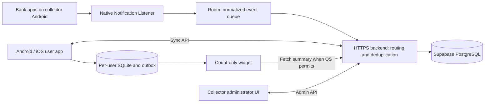

# Quản lý Tao — Design and Implementation Plan

> **For Claude:** REQUIRED SUB-SKILL: Use `superpowers:executing-plans` to implement this plan task by task if that skill is available. For Codex, Antigravity, or environments without that skill, follow the tasks and verification criteria in this document directly. No particular agent plugin is required.

**Goal:** Build the Android/iOS personal finance app **Quản lý Tao** and a separate Android collector app that receives shared bank notifications and routes transactions to fewer than five initial users through a backend and Supabase.

**Architecture:** A native Android collector captures and normalizes bank notifications. A backend owns authentication, administration, routing, and synchronization; Supabase hosts PostgreSQL. The Flutter user app maintains an offline SQLite database and platform-native count-only widgets. All mobile access to cloud data goes through the backend.

**Proposed stack:** Flutter/Dart, Riverpod, go_router, Drift/SQLite; Kotlin/Room/WorkManager for Android capture and widget support; Swift/SwiftUI/WidgetKit for the iOS widget; Python/FastAPI/Pydantic/psycopg/Argon2 with PostgreSQL on Supabase. Select compatible versions during setup and commit lockfiles. Do not upgrade every existing dependency without a reason.

**Date:** 2026-10-03. **Status:** Implementation handoff plan only. Application code, databases, and the Linux application have not been changed. New paths below describe the intended structure; they do not necessarily exist yet.

**Document language:** English. Product names, Vietnamese UI labels, and default category/tag names intentionally remain in Vietnamese.

---

## 1. Instructions for the implementing agent

1. Read this document completely and follow applicable `AGENTS.md` instructions. Inspect `git status` and preserve unrelated user changes. If the checkout contains `.codegraph/`, use CodeGraph before searching or reading code. The inspected checkout did not contain it.
2. Do not ask the user to reconfirm decisions recorded in section 2. Technical choices in this document are implementation defaults; record justified deviations in `docs/decisions.md`.
3. Execute implementation tasks incrementally, but run all tests and validation only in the final T23 phase, as explicitly requested by the user. Earlier tasks may author tests and fixtures without executing them. Maintain `docs/implementation-status.md` with the task, changed files, commands actually run, results, and outstanding blockers or limitations. Never mark iOS verified based on Linux or Android execution.
4. Before T23, label finished implementation as `implemented — not yet validated`, not `verified` or `passing`. Create commits only when the current environment/session permits them. Group commits by task and exclude unrelated changes. This plan is executable by one agent; subagents are not required.
5. Do not print secrets from `.env`, signing files, or database connection strings. Reading `.env.example` is sufficient for discovering configuration names. Mobile builds receive only public configuration such as `API_BASE_URL`.
6. Do not reset the cloud database by default or delete old schemas while building the replacement. The user's decision not to migrate old personal data permits a fresh schema, not destruction of an unidentified project. Create a new `qlt` schema and follow the final cutover task.
7. Screenshots are examples, not complete Android notification payloads. Mark missing bank fixtures as unverified instead of inventing formats and claiming support.
8. Missing macOS access or bank fixtures blocks only dependent verification. Continue independent work and leave explicit handoff instructions for the remaining steps.
9. The delivered application must implement real backend integration and offline behavior. Do not stop at a visual prototype, placeholder screens, or scaffold.

## 2. Confirmed product requirements

### 2.1 Product scope

- User app name: **Quản lý Tao**, for Android and iOS. Support light/dark themes, defaulting to the operating-system setting.
- Separate Android collector app, proposed display name **Quản lý Tao — Máy chủ**. Both apps must coexist on the same phone. Later, the collector will move to a dedicated Android device.
- Remove the Linux desktop application. First extract shared code, tests, and useful tooling from its directory.
- No migration of existing personal finance data is required. Design the new schema and UI from scratch while reusing verified domain logic and tests.
- Backend deployment: initially a Mac mini M1 with 8 GB RAM/256 GB storage, or a VPS. PostgreSQL remains hosted on Supabase. Initial usage is fewer than five users; Redis, Kafka, and microservices are unnecessary.
- Run all testing at the end: Android on the user's physical phone connected by USB, and iOS on the iOS Simulator. Do not substitute an Android emulator for the final device test.
- Initial iOS delivery targets the iOS Simulator on macOS. Real-device background delivery and push verification are a later validation step, not a Simulator milestone promise.
- Support **VND only**. Do not collect, store, or synchronize bank account balances. A cash wallet is optional and manually maintained by the user.
- Preserve manual income/expense entry, reports, categories/tags, lending/borrowing, debts, and installments. Existing notes may remain as a secondary feature without a dedicated bottom tab.

### 2.2 Registration and administration

- Registration has exactly three fields: username, password, and password confirmation. No email, phone number, verification, or mandatory display name.
- The administrator approves the **user account once**. Approved users add their own bank links without further administrator approval.
- A user may link multiple banks but only one account number per bank.
- A bank/account-number pair is unique across all users, including soft-deleted users. Display **“Số tài khoản này đã được đăng ký”** on conflict without revealing the other user's identity.
- Users may change their bank account number themselves. The replacement must be unique. Preserve the original source of existing transactions, stop receiving for the old number, and show sharing instructions for the replacement.
- The administrator configures the recipient account and sharing instructions for each bank. Users enable automatic notification sharing inside their bank app. Quản lý Tao does not enable sharing on their behalf or connect to a bank API.
- Use a separate administrator account created through a bootstrap tool, with no public administrator registration.
- Administrator actions: approve a user, disable/enable bank capture, set a temporary password, soft-delete, restore, and permanently delete a previously deleted account.
- A temporary password forces a password change at the next login. Never show the previous password.
- Disabling capture preserves login, existing data, and manual entry. Do not backfill transactions from the disabled period when capture is re-enabled.
- Soft deletion moves the user to **“Tài khoản đã xóa”**, retains their data/account-number reservations, and prevents login and new capture. There is no timed automatic purge.
- Restoration restores the data and the previous capture preference. Revoked sessions remain revoked; the user logs in again.
- Permanent deletion is an explicit administrator action: remove user data and release the username and bank-account reservations. Retain only the agreed non-content deduplication identifiers needed to prevent old events from reappearing.
- Multiple user devices are allowed. Do not add device-count limits or a user device-management screen. Idempotency is still required to prevent duplicate ledger entries.

### 2.3 Supported banks and capture

- First-release banks: **BIDV, VietinBank, Vietcombank, Techcombank**.
- **MB Bank is excluded** because its notification masks the owner account number.
- Capture only verified bank package names, successful VND transactions, and an unmasked owner account that exactly matches an enabled registry entry.
- A counterparty account appearing in transfer content is not the owner account. Never route by a suffix, masked-number approximation, counterparty account, or guessed identity.
- Do not create an “unrecognized notifications” inbox. Drop unmatched, ambiguous, advertising, OTP, failed, or unsupported notifications. Payload-free counters/reason codes may be retained for diagnostics.
- Capture must not depend on the Flutter UI being open. Support screen lock and recovery after reboot within Android's actual platform constraints.
- Force-stop, revoked permission, and notifications removed while the listener was unavailable have real limitations. Do not promise recovery of bank history that Android never supplied.

### 2.4 User interaction and widgets

- Four bottom tabs: **Tổng quan / Thu chi / Biến động / Cài đặt**.
- **Biến động** combines all linked banks, newest transaction first, grouped by date. Show time, signed amount, bank/account, and bank-provided transaction content. Provide bank and income/expense filters.
- During classification, bank amount, direction, source, time, and content are read-only. Category is mandatory; tags and a separate personal description are optional.
- Show categories immediately in a **two-row, three-column grid**: the user's five most-used categories plus **“Khác…”**. Compute income and expense rankings separately.
- Do not suggest or preselect categories/tags based on transaction content or inferred behavior. Usage ranking is the only personalization requested.
- “Khác…” opens all categories and an inline **“Thêm danh mục”** action. The tag area includes **“+ Thêm tag”**. Creation selects the new item, preserves the current classification form, and works offline.
- Common flows require no more than five taps from the widget with one selected tag. Creating data, selecting multiple tags, debt workflows, and installment setup may require more, but should remain concise.
- For transfers between a user's own accounts, the user dismisses both notifications. Automatic internal-transfer matching is out of scope.
- Dismissal immediately hides the row and reduces the count. Show a bottom snackbar such as **“Đã bỏ qua giao dịch −500k”**, an **“Hoàn tác”** button, and a three-second countdown.
- Dismissing another transaction immediately finalizes the previous dismissal and replaces the snackbar with a fresh three-second undo window for the new transaction.
- When the undo window ends, remove the pending event locally and in the cloud when connected. There is no recoverable dismissal history.
- Acceptance creates a ledger transaction and deletes the pending event. The accepted transaction remains available for reports, category/tag/note editing, and deletion. Keep minimal deduplication receipts.
- Offline support covers manual entry, processing already downloaded pending events, and creating categories/tags. Synchronize when connectivity returns. Unknown server events cannot be displayed offline.
- The widget displays **only the pending count**, for example **“Có X giao dịch cần phân loại”**. No money, content, account number, or last-updated clock on its face. At zero: **“Không có giao dịch cần phân loại”**. Tapping opens **Biến động** directly.
- Request synchronization whenever the app opens or resumes. While foregrounded, refresh approximately every five minutes and support pull-to-refresh.
- Background widget refresh is best effort. The user accepts that iOS may take longer than five minutes. Android periodic WorkManager also cannot implement a guaranteed five-minute schedule.

## 3. Repository findings and migration map

The inspected HEAD was `b23913b`. Recheck the current HEAD and local changes before implementation.

| Existing component | Planned handling |
|---|---|
| `android/`: Flutter launcher; `android/lib/main.dart` calls `launchFinance()` | Move to `apps/user_app/`; add an iOS host |
| `android/pubspec.yaml` depends on `../linux/packages/finance_core` | Extract to `packages/finance_core/`; update dependency paths |
| `linux/packages/finance_core/lib/app/{router,theme,providers}.dart` | Reuse framework infrastructure; replace shell, routing, theme, and providers |
| `.../features/auth/auth_repository.dart`: Supabase email/password | Replace with backend username/session authentication |
| `.../core/sync/sync_engine.dart`: `finance_apply`, 30-second timer, offset-based full pulls | Replace with backend commands and consistent snapshot reconciliation |
| `.../features/bank_import/`: Android-native pending inbox | Replace with a synchronized, cross-platform local inbox |
| `android/android/app/src/main/kotlin/app/personalfinance/finance_android/banknotification/` | Move listener/parser/Room responsibilities to the collector; keep a rewritten widget in the user app |
| `parser/BankNotificationParser.kt`: generic parser and `takeLast(4)` account hint | Replace with bank-specific full-owner-account parsing before multi-user routing |
| `BankInbox.kt`: one owner and bank-balance snapshots | Replace with multi-user routing and remove balance handling |
| `BankInboxWidget.kt`: counts local bank-capture Room entries | Change to user-app synchronized pending state/cache |
| `BankSourceRegistry.kt`: includes MB but not VCB | Remove MB; add VCB only after verifying its actual package |
| `linux/supabase/migrations/001..006`: old public-schema/Auth design | Use as reference while building a fresh schema; do not apply a destructive reset to cloud |
| `linux/tool/{flutter_client,build_apk,generate_icons}.py` | Move/update under `tool/`; support both APKs; remove `.deb` packaging |
| Existing Android signing configuration and assets | Preserve external signing assets and update paths; do not delete or silently change keys |

Potentially reusable logic includes exact integer money handling, installment calendar calculations, debt principal rules, SQLite outbox patterns, and widget/deep-link patterns. Existing bank-balance models and Supabase Auth assumptions are not suitable for direct reuse.

## 4. Architecture decisions and release phases

### 4.1 Selected approach

Use **a dedicated backend plus Supabase PostgreSQL**. A single FastAPI service and database transactions are sufficient. The collector submits to an HTTPS ingest API; this is not a bank webhook. The user app fetches from the backend. The first release does not require an always-open socket or push delivery.

| Option | Trade-off |
|---|---|
| Dedicated backend with username authentication and one mobile API — selected | Fits Mac mini/VPS hosting and administrator permissions; requires explicit session and authorization implementation/tests |
| Supabase Auth plus Edge Functions | Reduces process hosting, but username-only authentication needs additional mapping or another auth design; do not introduce hidden fake-email assumptions into the product |
| Direct mobile database access or continuous polling | Complicates collector/admin permissions and does not solve OS background limits |

**Phase A, required:** backend, database, administration, both mobile apps, offline workflows, supported-bank parsing with evidence, count widgets, Android-device validation, and iOS Simulator handoff/validation.

**Phase B, optional:** FCM/APNs/WidgetKit push for faster freshness. Do not block Phase A on Apple push credentials. The earlier 10–20-second widget requirement was superseded by count-only display and best-effort refresh.



### 4.2 Target repository structure

```text
apps/
  user_app/                    # Flutter Android + iOS: Quản lý Tao
    lib/main.dart
    android/                   # No NotificationListenerService
    ios/Runner/
    ios/InboxWidgetExtension/   # Actual WidgetKit Xcode target
    integration_test/
  collector_app/               # Flutter admin UI + native Android collection
    lib/{main.dart,app/,features/}
    android/app/src/main/kotlin/app/quanlytao/collector/
      capture/ parser/ queue/ bridge/ registry/
packages/
  finance_core/                # User UI/domain/local DB extracted from Linux
  api_client/                  # DTOs, HTTP, errors, session handling; no secrets
backend/
  pyproject.toml
  uv.lock
  src/qlt/{main.py,config.py,db.py,auth/,admin/,ingest/,sync/,ledger/,catalog/,widgets/}
  tests/{unit/,integration/}
  migrations/
  scripts/
  Dockerfile
  .env.example
  ruff.toml
tool/
  flutter_client.py
  build_apk.py
  check_mobile_secrets.py
deploy/{compose.yaml,compose.test.yaml,Caddyfile,macos/}
docs/{api/openapi.json,decisions.md,implementation-status.md,runbooks/,plans/}
```

Proposed application IDs: `app.quanlytao.user` and `app.quanlytao.collector`; iOS app `app.quanlytao.user`, widget suffix `.InboxWidget`, App Group `group.app.quanlytao.user`. Centralize these values so an Apple signing prefix can be changed deliberately. This is a fresh installation; do not migrate old Finance Inbox sessions/local databases or automatically uninstall the old app.

## 5. User experience specification

### 5.1 Layout and interaction principles

- Vietnamese is the default language. Use system fonts with complete Vietnamese support. Use platform-appropriate controls while keeping workflows consistent.
- Light theme: neutral light surfaces with clear separation. Dark theme: dark surfaces with modest depth. Income is green, expense is red, with explicit signs/text so color is not the only indicator.
- Minimum touch target: 48 logical pixels. Test small screens, safe areas, keyboard interaction, and text scaling from 1.3 to 2.0.
- Keep the category grid at three columns at normal sizes. Accommodate accessibility text with taller cells/wrapping instead of truncating labels.
- Avoid extra modal steps in common flows. Do not require an initial language-selection screen.
- Define loading, empty, error, offline, pending-sync, and revoked-session states.
- The dashboard shows income, expense, and the difference for the selected period, never a bank balance. Reports exclude pending bank events. Debt principal is tracked separately from ordinary income/expense.

### 5.2 Screen inventory

| Screen | Behavior |
|---|---|
| Login/Register | Minimal username/password forms; confirmation only on registration; inline validation |
| Awaiting approval | Status, refresh, logout; no bank-link creation or financial-data access |
| Temporary-password change | Mandatory new-password/confirmation form before normal app access |
| Tổng quan | Month selector, income/expense/difference, reports, manual entry, shortcuts to debts/installments/notes |
| Thu chi | Recorded transactions by date; search/filter/detail; edit category/tag/personal note; bank source/amount/time remain read-only |
| Biến động | All pending events; descending transaction time; bank/direction filters; date grouping; amount, bank/account, time, and bank content |
| Classification | Adaptive bottom sheet/route; read-only summary; immediately visible category grid; tags; collapsed “Thêm mô tả”; final “Chấp nhận” |
| All categories | Opened within classification; optional search; inline “Thêm danh mục”; return to the same draft |
| Linked banks | Choose bank, enter account, save, show current administrator instructions; show “Đang chờ nhận dữ liệu” until a real matching event arrives |
| Cài đặt | Banks, categories/tags, system/light/dark theme, password, optional cash wallet, synchronization status, logout |
| Collector status | Permission and listener connection separately; backend health, active collector, queue size, latest receive/send times, payload-free counters, reconnect/retry |
| Collector users | Pending/active/deleted lists; approval, capture toggle, password reset, soft deletion, restore, permanent purge |
| Collector configuration | Bank recipient/instructions, server connection, admin password, collector-device handover |

Do not display “sharing is active” merely because the user presses a button saying they completed the bank instructions. `first_received_at` is the first evidence of successful receipt.

### 5.3 Tap budgets

| Common flow | Tap sequence |
|---|---|
| Accept from widget with one tag | Widget (1) → card Chấp nhận (2) → category (3) → tag (4) → final Chấp nhận (5) |
| Accept from an already-open app | Biến động tab (1) → Chấp nhận (2) → category (3) → tag (4) → save (5) |
| Accept without tags | Skip the tag tap: four taps from widget |
| Dismiss | Widget (1) → Bỏ qua (2); undo is optional |
| Normal manual entry | Add action (1) → amount field (2, type) → category (3) → optional tag (4) → save (5) |
| Change a ledger category | Thu chi tab (1) → row (2) → directly visible category choice (3) → save (4) |

Count navigation, selection, and submission taps, not every keyboard character or OS unlock gesture. Provide separate +Thu/+Chi entry actions so direction does not require another step. Source/date changes, adding data, multiple tags, and debt/installment configuration are extended flows.

### 5.4 Category/tag behavior and default seeds

- Rank the top five by the count of existing recorded transactions using that category, per user and direction. Include manual/accepted transactions, not inbox events or unresolved conflicting tentative entries.
- Recompute after ledger edits/deletions. Ties use seed rank, then name, then UUID. Fill empty positions from active categories in default order.
- Do not reorder an already-open classification sheet; recompute next time it opens. Nothing is preselected.
- Category fields include direction, name, icon, archived status, seed rank, and behavior. Tags belong to a category.
- Display readable names with Vietnamese accents. Do not force new tags into the old accentless hashtag format.
- Normalize name uniqueness by trimming, collapsing spaces, and case folding. Category uniqueness is scoped to user/direction; tag uniqueness to user/category.
- Archived items stay readable in history but disappear from new selection lists.
- Inline creation requires only a name; derive direction/category from context. Generate the local UUID and persist/enqueue it before dependent acceptance.

| Expense category | Default tags |
|---|---|
| Ăn uống | Ăn sáng, Ăn trưa, Ăn tối, Cà phê |
| Đi lại | Xăng xe, Gửi xe, Taxi, Xe công nghệ |
| Mua sắm | Quần áo, Đồ cá nhân, Đồ gia dụng |
| Nhà & hóa đơn | Tiền nhà, Điện, Nước, Internet |
| Giải trí | Xem phim, Game, Đi chơi |
| Sức khỏe | Thuốc, Khám bệnh, Thể thao |
| Học tập | Học phí, Sách, Khóa học |
| Gia đình & quà tặng | Gia đình, Quà tặng, Hiếu hỉ |
| Du lịch | Vé xe/máy bay, Lưu trú |
| Chi khác | No required seed tag |

| Income category | Default tags |
|---|---|
| Lương | Lương chính, Phụ cấp, Làm thêm giờ |
| Thưởng | Thưởng tháng, Thưởng quý, Thưởng Tết |
| Kinh doanh | Bán hàng, Dịch vụ |
| Làm thêm | Freelance, Dạy học, Công việc phụ |
| Được tặng | Gia đình, Bạn bè, Mừng tuổi |
| Thu khác | Hoàn tiền, Khác |

The sixth grid control “Khác…” opens the catalog; it is not the actual “Chi khác” or “Thu khác” category.

### 5.5 Debts, installments, cash, and secondary features

- Debt management is reached from Tổng quan. Choose lending/borrowing, select or create a person inline, enter amount/date, and save. Debt details expose repayment/collection and remaining principal.
- Classification may expose an extended “Gắn với công nợ” action. Create/link a debt or repayment atomically with the accepted event. One event must not independently create both an ordinary transaction and an extra repayment transaction.
- Exclude debt principal from ordinary spending/income. Do not automatically calculate interest in the first release. A future interest split must preserve the total bank movement and have a verified UX.
- An installment plan contains expected payment dates/amounts and a previewed total. Scheduled items are forecasts, not already-paid future expenses.
- A cash installment payment creates a payment and ledger entry. A bank payment links the accepted event to the installment instead of adding a second expense. Report actual payments on the actual payment date.
- Reuse tested calendar calculations, but do not directly copy the old implementation that creates future-dated expense rows as the schedule.
- A cash wallet is optional; onboarding does not require one. Allow an opening amount and manual adjustments if needed. Adjustments are not ordinary income. This is an implementation interpretation of the user's optional cash-wallet request; it must not introduce bank balances.
- Preserve useful note functionality in a secondary location if retained. Do not sacrifice required financial fields merely to satisfy the common-flow tap budget.

## 6. Backend authentication and data isolation

### 6.1 Usernames, passwords, and sessions

- Proposed username rule: ASCII `[a-z0-9_.]{3,32}`, lowercase/trimmed, unique. Password: 8–128 characters, never silently trimmed, no mandatory special-character rule.
- Validate confirmation in the client. The registration API accepts username/password only.
- Hash passwords with Argon2id using a maintained library such as `pwdlib[argon2]`. Do not implement password hashing or cryptographic primitives yourself.
- Use opaque random 256-bit bearer sessions; store only token hashes. Suggested lifetime: 30 days, renewable while valid. Revoke on logout, password reset, or soft deletion. JWT is unnecessary for this deployment.
- Pending users may access only account status, logout, and applicable password-change actions. Financial/bank APIs require an active user.
- Temporary-password sessions permit only account status, password change, and logout until the password is changed.
- The admin may choose a temporary password or generate one using a cryptographically secure library. Display it only at creation. Reset revokes all user sessions and widget credentials.
- Bootstrap the administrator through a CLI with non-echoed password input. Never hardcode its credentials.
- Give the background collector a separate limited credential for registry, ingest, and heartbeat. Do not store the administrator password in the worker.
- Rate-limit registration/login/password-reset routes. A reverse-proxy limit plus an in-process limiter is sufficient for the single-instance first release. Do not log financial request bodies, passwords, or bearer tokens.
- Logout stops sync, removes credentials/widget cache, and isolates local data by user. If unsynchronized operations remain, warn before the user deliberately discards local state; do not silently erase the outbox.
- A deleted user may retain cached data on a device that stays offline. On reconnection, return `ACCOUNT_DELETED`, lock the UI, and clear local/widget state. Document this limitation rather than promising offline remote erasure.

### 6.2 Database access and authorization

- Mobile apps contain no Supabase service-role key, PostgreSQL credentials, or embedded administrator credential. Only the backend connects to PostgreSQL.
- Keep the `qlt` schema outside exposed Supabase Data API schemas. Revoke inappropriate `anon`, `authenticated`, and `PUBLIC` grants on sensitive schemas/tables/functions.
- The new username-session system does not use the old Supabase `auth.uid()` assumptions.
- Separate migration and runtime database roles. The normal runtime role is not a table owner, superuser, or `BYPASSRLS` role.
- User-owned tables carry `user_id`. RLS can use `current_setting('app.user_id', true)`, set with transaction-local `set_config(..., true)` from the authenticated backend session, never from a client-supplied owner field.
- Authentication, ingest, and administrative operations use a privileged role with grants limited to their functions. Credentials remain server-side. Keep privileged and regular connection pools separate; do not leak tenant context across pooled requests.
- Test isolation using actual runtime roles, not only the PostgreSQL owner role.
- Start with a small psycopg pool of approximately 2–5 connections. Prefer a direct Supabase connection for a persistent server; use the session pooler if the host requires IPv4. Use the actual project connection URL and verified TLS.

## 7. New database schema and invariants

Use UUID entity IDs, UTC `timestamptz`, and Asia/Ho_Chi_Minh for bank-text parsing and default reporting dates. Store VND as integer `bigint`; normal amounts are positive with a separate income/expense direction. Never use floating-point money.

Limit a single amount to `9_000_000_000_000_000` VND. Encode monetary API values as decimal strings to preserve precision across Dart/Python/JavaScript. Account numbers are text and retain leading zeros.

| Table | Core fields and constraints |
|---|---|
| `users` | id, username/key unique, password_hash, role(user/admin), status(pending/active/deleted), capture_enabled, capture_epoch, must_change_password, deleted_at, created_at; public registration cannot select admin role |
| `sessions` | token_hash unique, user_id, expires_at, revoked_at, scope; no plaintext token |
| `widget_tokens` | token hash, user_id, expires_at, revoked_at; count-only scope |
| `bank_settings` | bank_code PK, enabled, receiver_account, optional receiver_name, instructions, version; only four supported bank codes |
| `bank_bindings` | id, user_id, bank_code, account_number, version, capture_from, first_received_at; UNIQUE(user_id,bank_code), UNIQUE(bank_code,account_number); preserved for soft-deleted users |
| `collector_devices` | id, credential_hash, state(active/retired), epoch, last_heartbeat_at; at most one active collector enforced transactionally/by constraint |
| `ingest_receipts` | fingerprint PK, algorithm_version, created_at; HMAC digest only, no user ID/account/amount/content |
| `pending_bank_events` | id, user_id, binding_id, bank_code, owner_account_snapshot, amount_vnd, direction, occurred_at, time_source, received_at, bank_description, fingerprint unique, parser_version, version |
| `transactions` | id, user_id, direction, amount_vnd, occurred_at, source(bank/cash/manual), bank/account snapshots for bank sources, read-only bank_description, category_id, user_note, purpose(normal/debt_principal/installment_payment), optional cash_wallet_id, version, unique nullable source_event_key |
| `categories` | id, user_id, direction, name/key, icon, archived, seed_rank, behavior, version; unique(user_id,direction,name_key) |
| `tags` | id, user_id, category_id, name/key, archived, version; unique(user_id,category_id,name_key) |
| `transaction_tags` | user_id, transaction_id, tag_id; owner-scoped composite FKs and category validation |
| `people` | id, user_id, name, optional note, version |
| `debts` | id, user_id, person_id, direction(lent/borrowed), principal_vnd, started_at, optional due_at, status, version |
| `debt_payments` | id, user_id, debt_id, amount_vnd, paid_at, unique transaction_id, version |
| `debt_disbursements` | user_id, debt_id, unique transaction_id; no second ledger row for an already accepted event |
| `installment_plans` | id, user_id, name, category_id, start_date, period_count, version |
| `installment_items` | id, user_id, plan_id, sequence, due_date, expected_vnd, version; unique(plan_id,sequence) |
| `installment_payments` | id, user_id, item_id, unique transaction_id, amount_vnd |
| `cash_wallets` | id, user_id, name, opening_amount_vnd, opening_at, version; no bank-balance relationship |
| `cash_adjustments` | id, user_id, wallet_id, delta_vnd, at, version; excluded from normal income/expense |
| `notes` | id, user_id, content, pinned, version; secondary feature if retained |
| `user_revisions` | user_id PK, revision bigint; locked and incremented within each user-data mutation |
| `operation_receipts` | user_id, operation_id, request_hash, outcome_code, optional result_entity_id, created_at; unique(user_id,operation_id); no request or financial payload copy |
| `admin_audit` | admin_id, action, optional target_id, at, outcome; no money/account/password payload; remove or anonymize target linkage during purge |

Use `(user_id,id)` foreign keys for owned entities to prevent cross-user category/tag/debt attachment. Index pending events and ledger by `(user_id,occurred_at DESC,id DESC)`, session hashes, and binding uniqueness.

Changing an account number updates its binding and increments its version. Existing pending/ledger rows retain immutable account snapshots. Composite owner checks still apply to relationships. Revoking capture must not silently delete pending events that were already legitimately ingested.

### 7.1 Event lifecycle and hard deletion

```text
notification → matching ingest receipt + pending event, atomically
pending → accept → ledger entry + delete pending, atomically
pending → discard → delete pending after local undo deadline
ingest receipt survives both outcomes without transaction content
```

- Insert the ingest receipt at ingestion, in the same transaction as the pending event. Do not wait until acceptance/dismissal to create it.
- A matching fingerprint returns a terminal duplicate acknowledgment and never recreates the pending event.
- Acceptance locks the owner's pending row, validates categories/tags, inserts ledger/tag relationships, deletes pending, records the operation receipt, increments revision, and commits as one transaction.
- Dismissal follows the same pattern without a ledger insertion.
- If pending is already gone, return terminal `ALREADY_RESOLVED`; do not reconstruct it from client data.
- Repeating the same `operation_id` and request returns its previous outcome. Reusing the ID with different content returns 409.
- Receipts may contain outcome enums and opaque entity IDs, never financial payload copies. If the ledger is later deleted, replaying acceptance must not recreate it.
- Concurrent accept/accept or accept/discard: the first committed terminal action wins. The other client removes its tentative operation result and reconciles. Do not apply last-write-wins to resurrect an inbox event.
- Ledger deletion is a hard deletion plus revision update. The ingest receipt continues blocking bank-event replay.
- Archive used categories/tags instead of breaking history.
- “Delete from the database” means remove active business records, not a promise of immediate erasure from provider-managed backups/PITR. Never retain payload copies in logs, receipts, audit, or an additional cloud queue.

## 8. API contract

Base path `/v1`; bearer authentication; snake_case JSON. Error shape: `{code,message,request_id}` without another user's identifying information.

User mutations include an `operation_id` UUID and, when modifying an existing entity, `base_version`. Derive the user from the session, never from a body-supplied owner. Errors: 401 session, 403 role/status, 409 conflict/duplicate account, 422 invalid data, 429 throttled.

| Endpoint | Authorization and purpose |
|---|---|
| `POST /auth/register` | Public username/password registration to pending status; defaults seeded idempotently on approval |
| `POST /auth/login`, `/auth/renew`, `/auth/logout` | Session lifecycle; enforce role at each resource endpoint |
| `GET /me`, `POST /auth/change-password` | Account status and password changes, including restricted temporary-password sessions |
| `GET /banks` | Active user sees configured sharing instructions, not the global routing registry |
| `GET /bank-bindings`, `POST /bank-bindings`, `PATCH /bank-bindings/{id}` | Own bindings only; global uniqueness enforced in PostgreSQL |
| `GET /sync/snapshot?known_revision=...` | Complete consistent user snapshot or unchanged result |
| `POST /sync/operations` | Ordered batch of typed commands, each individually atomic with its own result |
| `GET /pending-events` | Optional list/debug endpoint; snapshot remains the reconciliation authority |
| `POST /pending-events/{id}/accept` | Category, tags, optional personal note, client transaction UUID, optional relation; bank financial fields come from server data |
| `POST /pending-events/{id}/discard` | Called after undo deadline; terminal/idempotent |
| `POST /widget-token`, `DELETE /widget-token` | Full active session creates/revokes count-scoped credentials |
| `GET /widget/summary` | Count/revision and opaque pending IDs for local reconciliation; no financial content |
| `GET /admin/users?status=...` | Administrator user listing |
| `POST /admin/users/{id}/approve` | Approval plus defaults in one transaction |
| `PATCH /admin/users/{id}/capture` | Capture toggle with epoch invalidation |
| `POST /admin/users/{id}/temporary-password` | Temporary password and session/widget-token revocation |
| `DELETE /admin/users/{id}` | Soft deletion only |
| `POST /admin/users/{id}/restore` | Restore with a new capture epoch |
| `POST /admin/users/{id}/purge` | Permanent purge of a soft-deleted user; protected by explicit UI confirmation |
| `PUT /admin/banks/{code}` | Recipient details, sharing instructions, version |
| `POST /admin/collectors`, `POST /admin/collectors/{id}/activate` | Enrollment, credential rotation/revocation, active-collector fencing |
| `GET /collector/registry` | Collector credential only: enabled bindings, versions, capture epochs/cutoffs; no passwords/ledger |
| `POST /collector/events` | Batch normalized events; per-item accepted/duplicate/dropped/retry result; server revalidation |
| `POST /collector/heartbeat` | Connection/permission/queue/counters without notification contents |
| `GET /health/live`, `/health/ready` | Liveness/readiness; ready checks DB without leaking configuration |

`/sync/operations` must use a discriminated union of explicit commands: `catalog.create/update/archive`, `ledger.create_manual/update/delete`, `pending.accept/discard`, `debt.create/repay`, `installment.create/pay`, `cash.adjust`, and `note.upsert/delete`. Define field schemas in OpenAPI; do not expose arbitrary table writes or SQL.

Example acceptance request:

```json
{
  "operation_id": "8fca9b08-3bfa-4a5b-8e22-941650770101",
  "transaction_id": "8fca9b08-3bfa-4a5b-8e22-941650770102",
  "category_id": "8fca9b08-3bfa-4a5b-8e22-941650770103",
  "tag_ids": [],
  "user_note": ""
}
```

Example collector item, using synthetic values:

```json
{
  "event_id": "8fca9b08-3bfa-4a5b-8e22-941650770104",
  "collector_epoch": 2,
  "binding_id": "8fca9b08-3bfa-4a5b-8e22-941650770105",
  "binding_version": 1,
  "capture_epoch": 1,
  "bank_code": "bidv",
  "owner_account": "000123456789",
  "direction": "expense",
  "amount_vnd": "2000",
  "occurred_at": "2026-10-02T14:52:00Z",
  "posted_at": "2026-10-02T14:52:05Z",
  "time_source": "bank_text",
  "bank_description": "Chuyen tien",
  "bank_reference": "SYNTHETIC-REF-001",
  "source_package": "com.vnpay.bidv",
  "parser_version": "bidv-v2",
  "source_event_key": "opaque-stable-capture-key"
}
```

Never send raw notification bodies, balances, or a client-selected destination user ID. Technical identity fields can be discarded after fingerprint computation; pending records keep only what the product needs. Only the active collector credential may ingest events.

## 9. Notification parsing, deduplication, and collector behavior

### 9.1 Native processing pipeline

1. `NotificationListenerService` checks the exact package allowlist before reading extras. Ignore group summaries. Extract bounded title/text/bigText/textLines and avoid duplicate representations of the same content.
2. Use the bank-specific parser to obtain the full owner account, signed VND amount, transaction time, and bank description. Strip balance field segments from persisted descriptions; do not store the whole raw notification as the description.
3. Match the cached registry by exact bank/account, active binding version, and capture epoch. Unknown accounts are dropped without a queue entry. Before the first successful registry download, report “Chưa sẵn sàng” rather than collecting everything for later.
4. Commit the normalized event to Room and assign its stable UUID once. Queue processing is independent of Dart/Flutter UI. Local uniqueness suppresses repeated callbacks.
5. Schedule unique one-time WorkManager upload with a network constraint. Use bounded batches and exponential backoff with jitter. Terminal accepted/duplicate/drop responses delete the local payload; timeout/5xx retains the same item/ID. Authentication failures require correct credential recovery, not a busy loop.
6. The backend rechecks collector epoch, binding version, capture epoch, bank/account, and user status. Never reroute a queued old event to a new user who later registers that account number.
7. Heartbeats and status screens contain only health information. Successfully uploaded payloads do not remain as an administrator transaction-history feature.

Disable, soft-delete, account replacement, and restoration increment the relevant capture/binding epoch and cutoff. Already-ingested pending events remain available to their owner. Old-epoch events still waiting in the collector queue are dropped after these changes; they are not backfilled on re-enable. State this consequence in administrator controls.

### 9.2 Bank formats and evidence levels

| Bank | Owner field and verification requirements |
|---|---|
| BIDV | Full account after `Tài khoản thanh toán:`; signed `Số tiền GD:`; `Thời gian giao dịch:` may put time before date. Counterparty accounts in content must not affect routing. Provided examples contain two +720k transactions at 22:20 and 22:24 with notification time 22:30: retain both and display their transaction times. |
| VietinBank | Full `TK:`, signed `GD:`, date/time after bank name, `ND:` content; discard `SDC:` balance. |
| Vietcombank | Provided in-app example is dated 2020: `Số dư TK VCB <account> <signed amount> VND lúc <date time>`. It is a reference fixture, not proof of current Android notification format or package. Obtain an actual shared-notification payload before enabling live capture. |
| Techcombank | Existing registry contains `vn.com.techcombank.bb.app`, but the current parser is generic and this conversation supplies no actual shared-notification payload. Verify real income and expense samples. |
| MB | Not selectable and never imported in Phase A, even when installed on the collector phone. |

Store sanitized fixtures under `apps/collector_app/android/app/src/test/resources/bank_notifications/`. Replace names/accounts/references consistently while preserving format. Do not rely on `/tmp/codex-clipboard-*` files or commit the user's financial screenshots.

A debug capture utility may collect a deliberately selected test notification only in a debug build, with visible operator action. It must not automatically upload all phone notifications.

Reject ambiguous ownership, masked accounts, ambiguous amount fields, unsupported currency, failed/pending/OTP messages, and invalid dates. If a proven format lacks a transaction timestamp but is otherwise unambiguous, use notification posting time with `time_source=notification`; label it “Giờ thông báo”. Parse bank dates in Asia/Ho_Chi_Minh regardless of the collector's device timezone.

### 9.3 Fingerprints and source limitations

- Compute `HMAC-SHA256(DEDUP_KEY, canonical_identity)` on the backend. A client-provided digest is not authorization or a routing bypass.
- Keep `DEDUP_KEY` stable and backed up separately. Moving/rotating collector credentials must not change it. Receipts never store plaintext identity.
- With a reliable bank reference, canonical identity includes bank, full owner account, canonical reference, direction, and amount. Exclude user ID, collector ID, parser version, and balance.
- Without a reference, use bank/account/direction/amount, the bank timestamp at its actual precision, canonical description, and a reliable source-event discriminator when available. Keep the stable event UUID for transport retries as well.
- Android notification keys may be reused. Never treat the notification key alone as the transaction identity.
- Repeated updates of one notification must deduplicate, while distinct transactions with identical amounts must not be merged merely because they occurred in the same minute.
- There is an unavoidable information limit: two real transactions with every observed field identical and no reference/seconds/discriminator cannot be proven distinct. Include this case in tests. Default to deduplicating exact identities and recording an ambiguity counter; do not claim exactly-once reconstruction from indistinguishable input.
- Duplicate responses are terminal acknowledgments so the collector can delete its queue item. Replay after accept, discard, or ledger deletion must never create a new inbox event.

### 9.4 Reboot recovery and collector handover

- Reuse the existing listener reconnect concept, but treat permission granted and listener connected as separate states.
- WorkManager restores queued work. Boot handling may enqueue/rebind using supported APIs; it cannot grant notification access or log into bank apps.
- Test before and after the first unlock following reboot. Protected storage/credentials may be unavailable until unlock; do not promise capture of notifications lost before storage becomes accessible.
- Reconnection may inspect currently active notifications using cutoffs and deduplication. It does not read Samsung notification history or bank-app transaction history.
- Handover: enroll the new phone, install/log into bank apps, grant notification access, drain the old queue when possible, activate the new collector transactionally, and increment the collector epoch. Old-device uploads then fail authorization/fencing.
- Warn about an undrained old queue before activation. If the old phone has failed, some events may be unavailable; do not promise bank backfill.

## 10. Offline state, undo, and deletion-safe synchronization

### 10.1 Per-user SQLite and snapshot reconciliation

Maintain a separate local database per user UUID with confirmed server state, a local optimistic overlay, and an outbox. Synchronize by pushing ordered operations, fetching the new snapshot, reconciling in one local transaction, and updating the widget cache.

Coalesce concurrent sync triggers into one flight. Trigger on open/resume, connectivity restoration, pull-to-refresh, and a five-minute foreground timer. Do not simulate background execution with a Dart timer.

For the initial scale, choose **complete consistent snapshots plus a revision** instead of incremental payload history. `GET /sync/snapshot` reads under REPEATABLE READ so tables and revision refer to the same database snapshot. Every user-data mutation locks the corresponding `user_revisions` row before changing entities and increments it within the transaction.

Do not use `updated_at > last_sync`, or separate offset pages without a snapshot token, as hard-delete reconciliation.

Replace confirmed local state only after receiving a complete valid snapshot. A failed or partial response must not delete local data. Missing entities are removed from confirmed state, while unacknowledged local operations remain in the separate overlay/outbox. If pagination becomes necessary, implement a consistent snapshot token/materialized snapshot rather than offset races.

An unchanged revision may return an unchanged response. Push dependencies first: category/tag creation precedes acceptance. Retries retain UUIDs.

Concurrent duplicate catalog creation returns the canonical entity ID so the client can remap dependent operations. Do not force a user to re-enter a category created offline. Ledger version conflicts preserve the server version and expose a recoverable conflict instead of silently overwriting it.

### 10.2 Durable three-second dismissal

```text
pending
  → undo_pending(deadline = tap time + 3 seconds, persisted locally)
     → undo before deadline: pending
     → deadline OR another dismissal: discard_queued
        → server acknowledgment: remove local payload and outbox entry
```

- One snackbar and one undo slot across the app. Drive the countdown from a deadline, not a sequence of timer ticks.
- Dismissing a second item atomically finalizes the previous slot and starts the new one.
- Persist the deadline before hiding the item. Backgrounding or killing the process must not extend it. On recovery, enqueue expired dismissals before reconciling server data.
- Do not call server deletion before the undo window ends. The cloud cannot be deleted while offline; local resolution is immediate and the delete is transmitted later.
- Count/list/widget state excludes locally resolved pending IDs immediately. An old server response must not restore a dismissed or accepted event.
- Share opaque locally resolved IDs with native widget state. A summary may include opaque pending IDs/count so count reconciliation can take a set difference without double-decrementing events the server already removed. Never put financial content in widget cache.
- Offline acceptance atomically creates a tentative ledger entry and pending acceptance operation. If another device already resolved the event, remove this operation's tentative ledger entry and reconcile; do not convert it into a new manual transaction.
- If an open classification form's event was resolved elsewhere, explain that it was already processed and close it. Never recreate an event from a stale form.

## 11. Widgets and background execution

### 11.1 Android user widget

- Use `AppWidgetProvider`/`RemoteViews` with a native count cache updated after local changes and synchronization.
- Deep link `quanlytao://bank-inbox` opens Biến động on cold and warm starts, including restoration of the intended route after authentication.
- Use unique periodic WorkManager work with an interval of at least 15 minutes for `/widget/summary`, a network constraint, bounded timeout, and a last-known cache. Count-only work does not need the Flutter UI.
- Store the count credential using Android Keystore-backed storage. Logout/reset/deleted-account responses clear widget data once detected. An offline widget may retain an old count until it can learn about a server-side change.
- Do not use exact alarms or a permanent foreground service simply to force five-minute polling.

### 11.2 iOS user widget

- Create a real SwiftUI Widget Extension target embedded in the iOS app, not unattached Swift source files.
- Use an App Group for `{user_scope,count,revision,locally_resolved_ids}` and Keychain sharing for the count token. Do not put bearer credentials in plaintext UserDefaults.
- The timeline provider fetches a summary when WidgetKit permits. A suggested 15–30-minute reload policy is a request, not a guarantee. The foreground app updates cache and requests timeline reloads after relevant changes.
- The extension performs its own bounded network request; it cannot depend on a running Dart isolate. On failure, display the last valid cache. Preview data is explicitly static preview data.
- Without a login, show “Mở Quản lý Tao để đăng nhập”.
- Count credentials have a configurable lifetime, for example 90 days, and are renewed from the app when opened. Revoke them under the account/session lifecycle rules. They cannot read ledger or bank content.
- Simulator validation covers build, adding the widget, themes, cache/HTTP behavior, and deep links. It does not establish real-device scheduling reliability.
- Optional Phase B push carries invalidation/current revision rather than stale transaction payloads. Fetch current backend state before updating. If a push queue is added later, retain user/revision only, not copies of deleted financial content.

Platform references: [WorkManager periodic minimum interval](https://developer.android.com/develop/background-work/background-tasks/persistent/getting-started/define-work), [WidgetKit refresh scheduling](https://developer.apple.com/documentation/widgetkit/keeping-a-widget-up-to-date), and [widget-extension network requests](https://developer.apple.com/documentation/widgetkit/making-network-requests-in-a-widget-extension). Do not advertise a guaranteed five-minute background schedule.

## 12. Implementation tasks

Implement T01–T22 first. Write behavioral tests, fixtures, and test procedures alongside the corresponding code, but do not execute tests, analysis, verification builds, migrations against a test database, or device/Simulator validation until T23. This ordering is an explicit user requirement and overrides a test-first execution workflow. Ordinary code inspection, dependency setup, source generation, and editing are allowed during implementation.

In each task below, “test”, “verify”, “build”, and “Done” describe checks and exit criteria to prepare for T23, not instructions to run them immediately. Mark implementation progress separately from validation. Pure layout work needs interaction/visual checks rather than tests that merely repeat implementation details. Final validation may uncover fixes; make those fixes and rerun the affected checks within T23.

Commands below describe the intended scaffold and checks. They are not claims that those checks have already run.

### T01 — Inspect the repository and prepare implementation tracking

**Files:** create `docs/implementation-status.md`, `docs/decisions.md`; inspect `README.md` and the sources listed in section 3.

1. Record git status/HEAD, applicable instructions, and installed Flutter/Dart/Java/Python/macOS tools.
2. Inventory the existing analyze/test commands and test suites without running them. Record any already-known failures from repository documentation; do not claim a passing baseline.
3. Record bank-package evidence, missing fixtures, and whether macOS is available. Do not inspect secrets to establish the inventory.

**Done:** repository inventory and explicit prerequisites; no tests executed and no feature behavior changed yet.

### T02 — Extract shared code and create the two applications

**Files:** move `linux/packages/finance_core/` to `packages/finance_core/`; move `android/` to `apps/user_app/`; create `apps/collector_app/` and `packages/api_client/`; update pubspec/tool paths.

1. Move shared code, useful tooling, and signing references while preserving files. Do not delete the Linux directory until necessary contents are extracted.
2. Create the Android collector Flutter host with a separate application ID. Move listener/parser/Room responsibilities to its Kotlin namespace.
3. Keep the rewritten widget/deep-link support in the user app and remove notification-listener permission/service declarations from that app.
4. Generate the user iOS host with Flutter tooling. Do not generate a replacement Linux desktop host. Record any host-generation/build steps requiring macOS.
5. Update display names, IDs, imports, and dependencies. Prepare both debug APK builds and side-by-side installation for final T23 validation.

**Done:** both applications launch independently; the user app does not request notification access; reusable tests and signing assets remain intact.

### T03 — Scaffold the backend and isolated test environment

**Files:** `backend/pyproject.toml`, `src/qlt/{main,config,db}.py`, `tests/conftest.py`, `deploy/compose.test.yaml`, `backend/.env.example`, lint configuration.

1. Create FastAPI health endpoints, typed configuration, and transaction-aware psycopg pooling. Select and lock a supported Python 3.12+ environment.
2. Start a separate PostgreSQL test service. Test fixtures may reset only the test schema; production DSNs must be rejected by destructive test setup.
3. Provide CLIs `python -m qlt.migrate`, `python -m qlt.bootstrap_admin`, and `python -m qlt.export_openapi`.
4. Prepare dependency installation and the commands `uv run pytest tests/unit` and `uv run ruff check .`; execute verification only in T23.

**Done:** readiness reflects DB availability; tests cannot accidentally reset the cloud database by default.

### T04 — Implement schema, constraints, and database permissions

**Files:** `backend/migrations/001_schema.sql`, `002_roles.sql`, `003_seed_banks.sql`; `tests/integration/test_schema.py`, `test_isolation.py`.

1. Create section 7 tables, indexes, owner-scoped FKs, account uniqueness, and the one-active-collector invariant. Do not create bank-balance fields.
2. Implement section 6.2 role/RLS rules and versioned migration tracking.
3. Test concurrent duplicate bindings, soft-deleted reservations, leading-zero accounts, cross-user attachment, missing tenant context, pooled-connection reuse, and denied anon/authenticated access.

**Done:** fresh-database migrations succeed; runtime-role tests reject cross-user access and privilege escalation.

### T05 — Implement username authentication and administrator lifecycle

**Files:** `backend/src/qlt/auth/{routes,service,passwords,sessions}.py`, `admin/users.py`, `tests/integration/test_auth.py`, `test_admin_lifecycle.py`.

1. Test registration, normalization/duplicates, pending restrictions, and user-to-admin access denial.
2. Implement opaque sessions, Argon2, approval with one-time default seeds, temporary-password flow, revocation, and logout.
3. Implement capture toggle/epoch, soft deletion, restoration, and permanent purge. Protect administrator accounts from ordinary user-purge flows.
4. Test no credential/hash leakage, immediate online API/widget denial after deletion/reset, retained reservations, restored accounts requiring fresh login, and released reservations after purge.

**Done:** complete tested auth/admin API; no password logs; repeated approval does not duplicate defaults.

### T06 — Implement shared API client and mobile authentication

**Files:** `packages/api_client/lib/{client,models,errors,session_store}.dart` and tests; `packages/finance_core/lib/features/auth/`, `app/providers.dart`; collector authentication UI.

1. Define DTOs, explicit commands, timeouts, and error mapping from OpenAPI. Mutation retries retain operation IDs.
2. Replace email/Supabase login with username registration/login, pending-approval UI, and forced password change. Use secure storage separately for each app.
3. Test login → pending → approval → home; temporary reset → password change; logout/user switch without cache leakage.

**Done:** user and administrator apps authenticate to the backend with correct privileges; no active direct Supabase Auth path remains.

### T07 — Implement bank links and sharing instructions

**Files:** `backend/src/qlt/catalog/banks.py`, `admin/banks.py`; `packages/finance_core/lib/features/banks/{bank_list,bank_link_form,sharing_guide}.dart`; backend and UI tests.

1. Seed `bidv`, `vietinbank`, `vietcombank`, `techcombank`; omit MB from selection.
2. Add/change full account strings. Normalize only allowed separators; preserve leading zeros. Enforce uniqueness in the database, not only by a preliminary lookup.
3. Load instructions from administrator configuration. If absent, show “Chưa có hướng dẫn”; do not invent bank-app steps. Do not introduce per-bank administrator approval.
4. Test binding version/epoch changes, preserved old transaction source snapshots, and first-received state derived only from a matching event.

**Done:** online linking works; cached instructions can be viewed offline. Creating/changing a bank link requires connectivity for global uniqueness checks.

### T08 — Implement strict bank parsers and sanitized fixtures

**Files:** collector Kotlin `parser/{ParsedEvent,BidvParser,VietinParser,VcbParser,TechcomParser,ParserRouter}.kt`; `src/test/resources/bank_notifications/`; parser tests.

1. Reuse exact-money/extraction helpers where correct. Replace suffix hints and remove balance model fields. `ParsedEvent` contains the full owner account.
2. Add income/expense, optional balance, counterparty account, wrapped-content, group-summary, and timestamp fixtures. The BIDV 22:20/22:24 examples must remain distinct despite equal posting times.
3. Implement each parser using actual evidence. If VCB/Techcom shared-notification fixtures are absent, gate live support and provide a deliberate debug-capture workflow.
4. Test rejection of MB, OTP, advertisements, failures, masked accounts, ambiguous amounts, invalid dates, and incorrect currency.

**Done:** verified fixtures pass. VCB/Techcom live support is enabled only with real notification evidence; missing fixtures are explicit blockers, not silent scope reductions.

### T09 — Implement collector registry, durable queue, and recovery

**Files:** collector `capture/{BankNotificationListenerService,NotificationExtractor,ListenerConnection}.kt`, `registry/RegistryStore.kt`, `queue/{CollectorDatabase,UploadWorker}.kt`, manifest, Room migrations, tests.

1. Cache the collector-scoped exact bank/account registry with versions/epochs.
2. Persist queue entries before scheduling work, independent of Flutter lifecycle. Never persist unknown/raw/balance data.
3. Implement per-item ACK/retry, stable IDs, counters, heartbeat, reconnect, and boot recovery.
4. Test process restart, lost acknowledgment, 5xx, changed binding, revoked permission, group summaries, and stale registry behavior.

**Done:** capture/queue continues without the Flutter UI; queued data survives restart; unknown events are dropped.

### T10 — Implement ingest routing and deduplication

**Files:** `backend/src/qlt/ingest/{routes,service,fingerprint,registry}.py`; `tests/integration/test_ingest.py`, `test_ingest_races.py`.

1. Test routing, forged ownership, package/bank mismatch, stale epochs, and disabled/deleted users.
2. Implement canonical HMAC and atomic receipt/pending insertion. Return terminal duplicate acknowledgments without storing receipt payloads.
3. Test retries before/after resolution, distinct same-amount events, collector handover, and transaction rollback consistency.

**Done:** one user's event cannot enter another inbox; successful payloads do not remain in collector history or audit.

### T11 — Implement ledger and catalog backend behavior

**Files:** `backend/src/qlt/catalog/{categories,tags,seeds}.py`, `ledger/{routes,service}.py`, domain tests.

1. Seed section 5.4 and implement deterministic rankings and canonical IDs for concurrent inline creation.
2. Implement manual entry/edit/delete and bank-ledger edit allowlists for category/tags/personal note only.
3. Implement period reports using recorded ledger transactions, with exact VND arithmetic, correct timezone boundaries, and principal/pending exclusion.

**Done:** no category inference or bank balances; foreign-user tags cannot be attached; historical archived labels remain readable.

### T12 — Implement atomic acceptance and dismissal

**Files:** `backend/src/qlt/ledger/resolve_pending.py`, `sync/receipts.py`, `tests/integration/test_resolve_pending.py`.

1. Test ledger creation plus pending deletion, dismissal without ledger creation, operation replay, and mismatched request reuse.
2. Lock the pending event, take financial fields from the database, validate catalog ownership, and update receipt/revision atomically.
3. Test concurrent accept/accept and accept/discard, replay after ledger deletion, and rollback without lost pending data.

**Done:** exactly one terminal resolution per identifiable event; client payload cannot change bank amount/source/time.

### T13 — Implement snapshot sync and offline local state

**Files:** `backend/src/qlt/sync/{routes,snapshot,operations}.py`; `packages/finance_core/lib/core/{database/local_database.dart,sync/sync_engine.dart,sync/outbox.dart}`; backend/Dart tests.

1. Implement consistent snapshots/revisions/unchanged responses. Use a consistent lock order: user revision before entity locks.
2. Implement per-user confirmed state, optimistic overlay, outbox, stable UUIDs, dependencies, receipts, and version conflict handling.
3. Test offline category/tag creation followed by acceptance, cross-device deletion, interrupted responses, concurrent snapshot mutations, terminal dismissal, and authentication failure preserving pending operations.

**Done:** hard deletion propagates without resurrection; no unsafe offset reconciliation or indefinitely retained financial tombstone payloads.

### T14 — Build theme, navigation, dashboard, and ledger screens

**Files:** `packages/finance_core/lib/app/{theme,router,app}.dart`, `features/dashboard/`, `features/transactions/`, UI tests.

1. Build the four-tab shell, Vietnamese labels, system/light/dark choice, and retained tab scroll state.
2. Implement period totals/reports without bank balances, and ledger synchronization indicators.
3. Build +Thu/+Chi forms within the normal tap budget. Bank financial fields remain read-only in recorded-transaction editing.
4. Inspect light/dark screenshots on a small screen and enlarged text. Verify semantics and actual interaction tap counts.

**Done:** no dedicated debt/notes bottom tab; readable, tested screens rather than unreviewed generated layouts.

### T15 — Build pending-event classification and inline creation

**Files:** `features/bank_import/{pending_bank_screen,bank_confirmation}.dart`, `features/catalog/{category_picker,tag_picker,inline_create}.dart`, interaction tests.

1. Implement bank/source/date/time/content cards, grouping, sorting, filters, and global count.
2. Show the 5+Khác grid immediately. Show category-specific tags after selection. Changing category clears selected tags but preserves a personal note.
3. Implement offline inline category/tag creation, immediate selection, keyboard/focus behavior, and preserved draft state. Do not add inferred suggestions.
4. Test the five-tap flow, optional tags, nested-picker return, and archived/history behavior.

**Done:** no extra tap to open a category selector; bank content and personal description remain distinct fields.

### T16 — Implement durable three-second undo

**Files:** `features/bank_import/discard_controller.dart`, `core/database/undo_slot.dart`; `discard_controller_test.dart`, `discard_recovery_test.dart`.

1. Use a fake clock to test before/at/after the deadline, consecutive dismissals, which item can be undone, backgrounding, and process restart.
2. Persist the undo slot atomically and coordinate snackbar/count/overlay. Queue server deletion only after finalization.
3. Test delayed server responses and set-based widget reconciliation without double decrement or resurrection.

**Done:** one snackbar; a second dismissal finalizes the first; no post-deadline recovery history.

### T17 — Adapt debts, installments, cash, and secondary features

**Files:** `features/debts/`, `features/transactions/installments.dart`, `features/cash/`; backend `ledger/{debts,installments,cash}.py`; domain/UI tests.

1. Port useful domain logic to the new schema/API and add dashboard shortcuts with inline person creation.
2. Link accepted bank events to debt disbursements/payments atomically and exclude principal from normal reports. Reject overpayment unless a deliberate product rule permits it.
3. Keep installment schedules separate from actual payments; link bank/manual payment once. Test month ends/leap years and no double counting.
4. Implement optional cash opening amounts/adjustments and retained secondary notes. Do not silently remove existing features that the plan says to preserve.

**Done:** correct reports and payment relationships; one bank movement does not become duplicate independent expenses.

### T18 — Build administrator UI and collector handover

**Files:** `apps/collector_app/lib/features/{status,users,bank_settings,device}/`, backend `admin/collectors.py`, tests.

1. Build the three administrator tabs and lifecycle actions with appropriate permanent-deletion confirmation.
2. Bridge native listener/permission/queue/retry state into the status screen without transaction-history payloads.
3. Implement recipient/instruction editing and clear loading/error/retry states.
4. Implement enrollment/activation, old-queue warning, epoch fencing, and rejected retired-device upload tests.

**Done:** one active collector; device replacement preserves users and ledger; administration works entirely from the collector app.

### T19 — Implement the Android user widget

**Files:** user Kotlin `widget/{BankInboxWidget,WidgetCache,WidgetRefreshWorker}.kt`, layout/XML, Flutter `features/widget/widget_bridge.dart`, native/Flutter tests.

1. Build count-only, zero, logged-out, and offline states with local resolution overlays.
2. Implement cold/warm deep links, including authentication redirect back to Biến động.
3. Add count-scoped summary fetching and periodic work of at least 15 minutes. Test malformed responses, 401, password reset, logout, and network failure.

**Done:** widget belongs to the user app, coexists with the collector, has no provider/action ID collision, and never displays money.

### T20 — Complete iOS host, widget target, and Simulator test instructions

**Files:** `apps/user_app/ios/Runner/`, `ios/InboxWidgetExtension/{InboxWidget,TimelineProvider,WidgetAPI,WidgetCache}.swift`, entitlements, Xcode project, Swift tests, `docs/runbooks/ios-simulator.md`.

1. Create and embed the Widget Extension target, configure App Groups/Keychain sharing, bundle IDs, plist, and deep links.
2. Implement secure count token, cache, fetching/reloading, local-resolution overlay, and platform-guarded Flutter bridging.
3. Prepare the macOS procedure for `flutter doctor -v`, dependency setup, `flutter build ios --simulator`, simulator discovery, and launch with `API_BASE_URL`. Document the actual generated Xcode scheme for Swift tests.
4. Prepare the Simulator checklist for adding the widget, themes, navigation, accept/discard counts, errors/cache, logout, versions, and screenshots. Execute it only in T23.

**Done:** iOS source and complete final-test instructions are prepared. Keep validation pending until macOS checks actually run; Android success is not iOS verification.

### T21 — Package backend deployment and operational documentation

**Files:** `backend/Dockerfile`, `deploy/{compose.yaml,Caddyfile,macos/}`, root `tool/`, `docs/runbooks/{server,collector,backup,bank-fixtures}.md`, `.env.example`.

1. Support a backend container or native launchd service on macOS, locked dependencies, restart policy, health checks, and an externally reachable HTTPS endpoint.
2. Choose a tunnel/reverse proxy based on the actual network. Do not ship a private LAN IP as the production endpoint.
3. Document Mac sleep/offline behavior and operational uptime settings. Cloud DB availability does not imply backend availability; collector/local queues must tolerate downtime.
4. Back up DB and stable deduplication key/config separately. Do not commit secrets or queue payloads. Collector credential rotation does not rotate the dedup key.
5. Update build scripts for `user`/`collector`, inject only `API_BASE_URL`, and scan artifacts/source for secrets without printing values.
6. Export OpenAPI and document administrator bootstrap, Android installation/signing, bank-package setup, listener permissions, reboot/recovery, and missing fixtures.

**Done:** backend restarts and serves HTTPS with correct readiness; mobile artifacts contain no database credentials; runbooks cover M1/VPS operation.

### T22 — Remove desktop Linux and prepare cutover/handoff

**Files:** remaining desktop `linux/` contents; root README, ignore rules, CI if present; implementation status and `docs/runbooks/acceptance.md`.

1. Confirm all required shared code/tooling/tests/SQL references have moved. Search active references to `../linux`, `linux/tool`, `.deb`, `finance_apply`, and `SUPABASE_ANON_KEY`; update them or mark historical documentation deliberately.
2. Remove desktop runner/packaging/tests, not Linux backend/server/CI support. Preserve signing files and `.env` during directory changes.
3. Finalize the acceptance matrix and an isolated fresh-schema rehearsal procedure for T23; do not execute them yet.
4. Prepare configuration templates and migration/cutover commands for the correct project, schema, administrator, collector, and user app. Execute production actions only after final validation and within session authorization. Never indiscriminately drop `public`.
5. Prepare delivery locations and documentation for APKs, iOS source, backend deployment, OpenAPI, screenshots, and the eventual validation report.

**Done:** implementation and cleanup are ready for testing; tests are still explicitly pending. Do not claim working end-to-end behavior or verified four-bank support yet.

## 13. Required acceptance matrix

| Area | Required scenarios |
|---|---|
| Registration | Three fields, duplicate username, pending restrictions, one-time approval, forced temporary-password change |
| Isolation | A cannot access B's pending/ledger/catalog; widget token cannot read content; user cannot call admin/collector APIs |
| Account routing | Full owner field, counterparty account ignored, one bank per user, global reservation, masked/MB rejected |
| Parser evidence | BIDV/Vietin samples; actual shared VCB/Techcom notification payloads before live enablement; ads/OTP/failures rejected |
| Time | Transaction time differs from posting time; distinct BIDV examples survive; UTC/Vietnam and period boundaries correct |
| Privacy | No bank balances/raw bodies in DB/queue/log/widget; original bank content separate from personal note |
| Ingestion | Retries/lost ACK/group updates/reboot do not duplicate identifiable events; distinct references/times remain distinct |
| Resolution | Accept inserts ledger and hard-deletes pending; discard inserts no ledger; retained receipts block replay |
| Undo | Three-second deadline, second dismissal commits first, only current item undoable, offline/restart do not extend window |
| Offline | Inline category/tag plus acceptance, durable outbox, complete snapshot reconciliation, terminal states do not resurrect |
| UI | Four tabs, two-by-three grid, income/expense ranking separately, optional tags, common five-tap flow, readable themes/text scaling |
| Widgets | Count only, cold/warm deep links, local undo/count correctness, no five-minute background guarantee, no stale-count resurrection |
| Administration | Toggle preserves data; soft-delete/restore retain reservations; purge releases; revoked sessions denied; no password logs |
| Collector | Locked screen, process death, reboot/unlock, revoked permission, reconnect, backend downtime, device fencing |
| Finance | Reports exclude pending/principal, no bank balance, installments paid once, optional cash adjustments not normal income |
| Platforms | User/collector installed together on Android; actual macOS iOS Simulator build/widget/deep-link evidence |

The matrix above is a specification to prepare during implementation. Execute it only in the final T23 phase below. Device testing uses the user's Android phone over USB and an iOS Simulator on macOS.


## 14. Risks, implementation assumptions, and evidence gates

1. **VCB/Techcom evidence:** The user reports full account numbers, but actual shared Android notification fixtures are still missing. Only the dependent live-bank support is gated; continue UI/backend work and retain the four-bank target explicitly.
2. **Account ownership trust:** The user explicitly chose no per-bank approval. Global account uniqueness does not prove ownership. Do not add unsolicited OTP/KYC; document the small trusted-group model and administrator handling of mistakes.
3. **Background reliability:** Neither platform guarantees five-minute widget refresh. Android OEM restrictions and force-stop may halt capture. Health/recovery/queues reduce disruption but cannot manufacture missed notifications.
4. **Server reachability:** A sleeping/offline Mac stops backend delivery despite a cloud database. Public HTTPS reachability and uptime require actual deployment configuration.
5. **Deletion and retry:** Retain content-free digest/operation receipts and reconcile complete snapshots. Do not remove receipts just to make tables empty and thereby reintroduce resolved events.
6. **Username authentication:** This replaces the old Supabase-email flow; update policies, adapters, and session lifecycle together. Do not use plaintext passwords or mobile service-role keys as shortcuts.
7. **Simulator versus device:** Widget scheduling/APNs and Android reboot behavior need the correct test platform. Swift files alone are not proof of an iOS build.
8. **Fresh installation:** New IDs permit coexistence. Do not automatically uninstall Finance Inbox or delete the old cloud schema during scaffolding.
9. **Cash/installment details:** Section 5.5 supplies implementation defaults to avoid double counting; the user did not specify each field individually. Keep these flows simple and record justified domain changes.
10. **Indistinguishable bank events:** No parser can reliably separate two real movements whose complete observable identities are identical. Preserve this limitation and test it instead of claiming absolute exactly-once reconstruction.

## 15. Official references to verify during implementation

- [Flutter iOS setup and Simulator](https://docs.flutter.dev/platform-integration/ios/setup).
- [Android WorkManager periodic scheduling](https://developer.android.com/develop/background-work/background-tasks/persistent/getting-started/define-work).
- [Android AppWidget updates](https://developer.android.com/develop/ui/views/appwidgets/advanced).
- [WidgetKit timeline refresh](https://developer.apple.com/documentation/widgetkit/keeping-a-widget-up-to-date).
- [WidgetKit network requests](https://developer.apple.com/documentation/widgetkit/making-network-requests-in-a-widget-extension).
- [WidgetKit push notifications: optional Phase B](https://developer.apple.com/documentation/widgetkit/updating-widgets-with-widgetkit-push-notifications).
- [Apple background earliestBeginDate is not a guaranteed launch time](https://developer.apple.com/documentation/backgroundtasks/bgtaskrequest/earliestbegindate).
- [Supabase direct connections and session pooling](https://supabase.com/docs/guides/database/connecting-to-postgres/pooling-and-limits).
- [PostgreSQL RLS and owner bypass](https://www.postgresql.org/docs/current/ddl-rowsecurity.html).
- [FastAPI password hashing with Argon2](https://fastapi.tiangolo.com/tutorial/security/oauth2-jwt/). Use the hashing guidance; this plan deliberately selects opaque sessions rather than requiring JWT.

These sources establish platform behavior. Verify SDK versions, signing requirements, dependencies, and installed bank-package identities again during implementation.


## 16. Final execution phase — run tests only here

### T23 — Run all verification, Android USB tests, and iOS Simulator tests

**Prerequisite:** T01–T22 implementation is ready. Earlier tasks may have prepared test files and scripts, but have not run their checks. This is the final implementation-plan phase, not an optional appendix.

**Files:** completed automated test suites; `docs/runbooks/acceptance.md`; `docs/implementation-status.md`; final screenshots/build artifacts and validation report.

**Step 1 — Prepare the final test environment**

- Inspect available host tools, test-only configuration, and database target guards.
- Run isolated migrations against the test PostgreSQL instance, never the production DSN by default.
- If tests were not run before implementation, report that fact. Do not invent an earlier passing baseline.
- Discover the user's USB Android device with `adb devices -l` and `flutter devices`. Use its actual serial for all device commands. If it is absent or unauthorized, ask the user to connect/unlock/authorize it at this final stage, while continuing independent automated tests.
- Discover the iOS Simulator on macOS. If this checkout is on Linux, complete the available checks and provide the exact macOS handoff. Keep iOS verification pending rather than replacing it with another platform.

**Step 2 — Run static checks, unit tests, and integration tests**

```bash
# Repository root: isolated test database, never production
docker compose -f deploy/compose.test.yaml up -d --wait

# backend/ — configure the documented test-only DSN first
uv sync --locked
uv run ruff check .
uv run pytest tests/unit tests/integration
uv run python -m qlt.export_openapi

# Each of packages/api_client/, packages/finance_core/,
# apps/user_app/, and apps/collector_app/
flutter pub get
flutter analyze
flutter test

# Both apps/collector_app/android/ and apps/user_app/android/
./gradlew :app:testDebugUnitTest
```

Run backend isolation, concurrency, retry, hard-delete, catalog dependency, monetary integrity, and snapshot tests against the actual runtime roles. Run fake-clock undo tests and native queue/parser tests. Inspect failures, fix their causes, and rerun affected checks before broadening to the remaining matrix.

**Step 3 — Build and test both Android apps on the USB phone**

```bash
# Repository root: wrapper uses public API_BASE_URL configuration
python3 tool/flutter_client.py user build apk --debug
python3 tool/flutter_client.py collector build apk --debug
adb devices -l
flutter devices

# Launch each app on the actual USB phone, in separate terminals if needed
python3 tool/flutter_client.py user run -d <ANDROID_USB_SERIAL>
python3 tool/flutter_client.py collector run -d <ANDROID_USB_SERIAL>

# Run prepared integration suites on that same physical device
# From apps/user_app/ and apps/collector_app/ respectively:
flutter test integration_test -d <ANDROID_USB_SERIAL> --dart-define=API_BASE_URL=<TEST_API_BASE_URL>
```

Placeholders must be replaced with discovered/configured values, not executed literally. Run the two app sessions independently so starting one does not terminate the other. Ensure the test backend is reachable from the phone; use a reachable test HTTPS endpoint or a documented debug-only `adb reverse` setup without shipping relaxed release network policies.

On the physical Android device:

1. Install both apps together and confirm their distinct identities and permissions.
2. Register two synthetic users, approve them through the collector UI, link separate test accounts, and verify owner isolation.
3. Exercise the complete widget → classification → category/tag → ledger flow and its tap count.
4. Verify skip/undo at three seconds, consecutive dismissal, process restart, offline processing, and reconnect.
5. Trigger synthetic notification fixtures from a dedicated debug/test mechanism. Production package allowlisting must remain strict; debug injection must not exist in release.
6. With operator-provided real bank notifications, verify actual package/payload parsing for each bank. Do not initiate monetary transfers without separate authorization. Missing real fixtures leave only that bank's live validation pending.
7. Verify screen lock, Flutter UI closure, listener reconnect, revoked permission, reboot/first unlock, and backend outage/queue recovery.
8. Add the real home-screen widget and verify count-only display, cold/warm deep links, local changes, logout, and offline cache behavior.
9. Verify temporary-password reset, capture disable/enable, soft-delete/restore/purge, reservations, and collector handover/fencing. A second physical collector is optional for initial testing; use automated credential/epoch tests and document if actual two-phone handover is not yet exercised.
10. Record phone model, Android version, app build IDs, screenshots, and actual results. Do not replace these tests with an emulator-only claim.

**Step 4 — Build and test iOS on the Simulator**

```bash
# macOS, repository root
flutter doctor -v
flutter devices
python3 tool/flutter_client.py user build ios --simulator
python3 tool/flutter_client.py user run -d <IOS_SIMULATOR_ID>

# apps/user_app/
flutter test integration_test -d <IOS_SIMULATOR_ID> --dart-define=API_BASE_URL=<TEST_API_BASE_URL>

# Discover the actual Xcode schemes before running native widget tests
xcodebuild -list -project ios/Runner.xcodeproj
```

Use the discovered project/workspace, scheme, and Simulator destination to run the prepared native tests; document the exact command actually used. On Simulator, verify registration/approval/login, four tabs, classification, inline categories/tags, offline/sync, both themes, enlarged text, and the actual embedded Widget Extension. Add the widget to the home screen and verify count updates and deep links.

Simulator networking must reach the test backend. Test failures must not be hidden by switching to fixed preview data. Do not claim that this establishes real iPhone background refresh or APNs delivery behavior.

**Step 5 — Complete acceptance, packaging, and handoff**

- Run every applicable row in section 13. Mark each as passed, failed, or blocked with evidence.
- Run artifact/source secret checks without printing matching secret values. Build release artifacts only if signing is available and authorized; debug APK verification is distinct from release delivery.
- Rehearse the fresh-schema cutover in isolation. Perform any production cutover only within explicit execution-session authorization after tests pass.
- Deliver actual user/collector APK paths, iOS source and Simulator instructions, backend/OpenAPI/runbooks, light/dark screenshots, and a concise test report.
- Missing USB authorization, macOS, real bank fixtures, or signing must be named precisely. Keep those validations pending; do not mark the entire release verified.

**Done:** available final checks have actually run, failures are fixed, and remaining external prerequisites are explicitly documented. This is the only phase where implementation may be labeled verified/passing.

## 17. One-line instruction to start the coding agent

Copy this instruction into Codex, Claude Code, or Antigravity in this repository:

> Implement `docs/plans/2026-10-03-quan-ly-tao-implementation.md` task by task; complete T01–T22 before running any tests, then execute final T23 using my USB-connected Android phone and the iOS Simulator, track progress in `docs/implementation-status.md`, and preserve all confirmed requirements and unrelated files.
